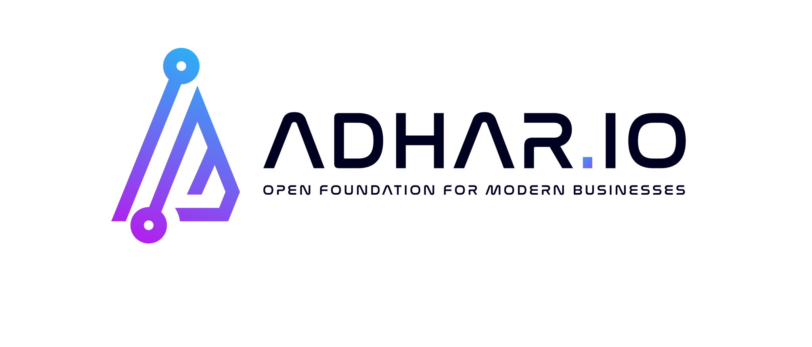

<h1 align="center">
  <br/>
  ADHAR.IO - Open Foundation for Modern Businesses
</h1>

<p align="center">
  <a href="https://join.slack.com/t/adharworkspace/shared_invite/zt-26586j9sx-QGrIejNigvzGJrnyH~IXww"></a>
  <a href="https://github.com/adhar-io/adhar/releases/"></a>
  <a href="https://hub.docker.com/r/adhar-io/adhar"></a>
  <a href="https://img.shields.io/github/adhar-io/adhar/actions/workflows/main.yml"></a>
  <a href="https://img.shields.io/github/last-commit/adhar-io/adhar"></a>
  <a href="https://img.shields.io/crates/l/ap"></a>
  <a href="https://adhar.io/"></a>
</p>

> :bulb: Adhar aims to revolutionise the software development by providing a comprehensive and integrated IDP(Internal Development Platform) that seamlessly integrates the leading open-source frameworks and libraries, embraces cutting-edge cloud-native practices, utilises containerization technology, leverages cloud infrastructure, strengthens identity and access management, ensures robust API governance, offers low-code application development capabilities, powers rapid application creation with Artificial Inteligence(AI), and oversees holistic application lifecycle management. ADHAR empowers developers and businesses with an all-encompassing ecosystem to innovate, collaborate, and deliver software solutions of unparalleled quality and efficiency.

## Adhar Platform Goals :rocket:

- All-in-One integrated platform supporting from application inception to post production lifecycle (Define -> Design -> Develop -> Deliver -> Discover)
- Great Developer Experience & Efficiency
- Well defined responsibility segregation betwwen Application team and Platform team
- Holistic and transparent governance
- Platform-as-a-product concept, so every company doesn't have to build one
- Evolve platform as per modern technology trends and industry best practices
- Integrate all leading opensource projects in best possible way to build the platform
- Apply GitOps principles as standard for infrastructure as well as application
- Fully Open source and always :sparkling_heart: other opensource tools and libraries

## How Adhar Platform Helps :dart:

**Design Team** - AI powered design assistance and realistic content generation along with easy design to code conversion.

- Build OCI compliant images from application code
- Deploy containerized workloads the GitOps way using build-in or BYO golden path templates
- Automatically update container images of workloads
- Publicly expose applications
- Get instant access to logs, metrics and traces
- Store charts and images in a private registry
- Configure network policies, response headers and CNAMEs
- Manage secrets
- Create private Git repositories and custom CI/CD pipelines

**Business Team** - Invole in transparent collaboration with Tech team by providing wireframes and prototypes and observing real progress from application perspective.

- Build OCI compliant images from application code
- Deploy containerized workloads the GitOps way using build-in or BYO golden path templates
- Automatically update container images of workloads
- Publicly expose applications
- Get instant access to logs, metrics and traces
- Store charts and images in a private registry
- Configure network policies, response headers and CNAMEs
- Manage secrets
- Create private Git repositories and custom CI/CD pipelines

**Application Team** - With easy self-service to let them focus on their apps only

- Build OCI compliant images from application code
- Deploy containerized workloads the GitOps way using build-in or BYO golden path templates
- Automatically update container images of workloads
- Publicly expose applications
- Get instant access to logs, metrics and traces
- Store charts and images in a private registry
- Configure network policies, response headers and CNAMEs
- Manage secrets
- Create private Git repositories and custom CI/CD pipelines

**Platform Team** - To setup a Kubernetes-based platform for developers and provide a paved road to production

- Create your platform profile and deploy to any K8s
- Onboard development teams in a comprehensive multi-tenant setup and make them self-serving
- Get all the required capabilities in an integrated and automated way
- Ensure governance with security policies
- Implement zero-trust networking
- Change the desired state of the platform based on Configuration-as-Code
- Support multi- and hybrid cloud scenarios
- Prevent cloud provider lock-in
- Implement full observability

**Management Team** - Access all the insights and reports to make the best possible business or technical decission based on actual datapoints

- Fully integrated analytics platform
- AI powered automated insights and recomendations
- Various reports showcasing different aspects of the application
- Realtime insights with zero filter
- Usage statistics and projection
- Easy Technology and Risk goverance
- Visibility of end to end process

## Getting started

### Helm

To install Adhar platform, make sure to have a kubernetes cluster running with at least:

- Version `1.25`, `1.26` or `1.27`
- A node pool with at least **8 vCPU** and **16GB+ RAM** (more resources might be required based on the activated capabilities)
- Calico CNI installed (or any other CNI that supports K8s network policies)
- A default storage class configured
- When using the `custom` provider, make sure the K8s LoadBalancer Service created by `Otomi` can obtain an external IP (using a cloud load balancer or MetalLB)

> **_NOTE:_** Install Adhar with DNS to unlock it's full potential. Check [adhar.io](https://adhar.io) for more info.

Add the Helm repository:

```bash
helm repo add adhar https://adhar.io/adhar/helm-charts
helm repo update
```

and then install the Helm chart:

```bash
helm install adhar adhar/adhar \
--set cluster.name=$CLUSTERNAME \
--set cluster.provider=$PROVIDER # use 'azure', 'aws', 'google', 'digitalocean', 'civo', or 'custom' for any other cloud or onprem K8s
```

## Documentations :book:

Learn about integrating, deploying and managing your apps on Adhar platform.

- [Architecture overview](./docs/architecture.md)
- [Setting up your environment](./docs/setup.md)
- [Development guide](./docs/development.md)
- [Adhar's OPA Policies framework](./docs/policies.md)
- [Schema validation](./docs/schema-validation.md)
- [Migrating values](./docs/migrating-values.md)
- [Go templating](./docs/go-templating.md)

## Platform architecture

<p align="center"></p>

### Self-service Portal and CLI

The self-service portal (Adhar Console) offers seamless user experience for developers and platform administrators. Platform administrators can use Otomi Console to enable and configure platform capabilities and onboard development teams. Developers can use Otomi Console to build images, deploy applications, expose services, configure CNAMEs, configure network policies and manage secrets. Otomi Console also provided direct and context aware access to platform capabilities like code repositories, registries, logs, metrics, traces, dashboards, etc. Next to the web based self-service, both developers and admins can start a Cloud Shell and run cli commands.

### Desired state store

When Adhar is installed, the desired state of the platform is stored in the Desired State Store (the `adhar/helm-chart-values` repo in the local Git repository). Changes made through the Console will be reflected in the repo.

### Golden templates catalog

The `adhar/helm-charts` Git repo includes a set of build-in Helm charts that are used to create workloads in the Console. You can also add your own charts and offer them to the users of the platform.

### Control plane

All changes made through the Console are validated by the control plane (`api-server`) and then committed in the state store. This will automatically trigger the platform to synchronize the desired state to the actual state of the platform.

### Automation

The automation is used to synchronize desired state with the state of applications like Keycloak, Harbor and Gitea.

### Capabilities

The platform offers a set of Kubernetes applications for all the required capabilities. Core applications are always installed, optional applications can be activated. When an application is activated, the application will be installed based on default configuration. Default configuration can be adjusted using the Console.

**Core Applications (that are always installed):**

- [Istio](https://github.com/istio/istio): The service mesh framework with end-to-end transit encryption
- [Keycloak](https://github.com/keycloak/keycloak): Identity and access management for modern applications and services
- [Cert Manager](https://github.com/cert-manager/cert-manager) - Bring your own wildcard certificate or request one from Let's Encrypt
- [Nginx Ingress Controller](https://github.com/kubernetes/ingress-nginx): Ingress controller for Kubernetes
- [External DNS](https://github.com/kubernetes-sigs/external-dns): Synchronize exposed ingresses with DNS providers
- [Argo CD](https://github.com/argoproj/argo-cd): Declarative continuous deployment
- [Gitea](https://github.com/go-gitea/gitea): Self-hosted Git service

**Optional Applications (that you can activate to compose your ideal platform):**

- [Velero](https://github.com/vmware-tanzu/velero): Back up and restore your Kubernetes cluster resources and persistent volumes
- [Argo CD](https://github.com/argoproj/argo-cd): Declarative continuous deployment
- [Knative](https://github.com/knative/serving): Deploy and manage serverless workloads
- [Kaniko](https://github.com/GoogleContainerTools/kaniko): Build container images from a Dockerfile
- [Prometheus](https://github.com/prometheus/prometheus): Collecting container application metrics
- [Grafana](https://github.com/grafana/grafana): Visualize metrics, logs, and traces from multiple sources
- [Grafana Loki](https://github.com/grafana/loki): Collecting container application logs
- [Harbor](https://github.com/goharbor/harbor): Container image registry with role-based access control, image scanning, and image signing
- [HashiCorp Vault](https://github.com/hashicorp/vault): Manage Secrets and Protect Sensitive Data
- [OPA/Gatekeeper](https://github.com/open-policy-agent/gatekeeper): Policy-based control for cloud-native environments
- [Jaeger](https://github.com/jaegertracing/jaeger): End-to-end distributed tracing and monitor for complex distributed systems
- [Kiali](https://github.com/kiali/kiali): Observe Istio service mesh relations and connections
- [Minio](https://github.com/minio/minio): High performance Object Storage compatible with Amazon S3 cloud storage service
- [Trivy](https://github.com/aquasecurity/trivy-operator): Kubernetes-native security toolkit
- [Thanos](https://github.com/thanos-io/thanos): HA Prometheus setup with long term storage capabilities
- [Falco](https://github.com/falcosecurity/falco): Cloud Native Runtime Security
- [Opencost](https://github.com/opencost/opencost): Cost monitoring for Kubernetes
- [Tekton Pipeline](https://github.com/tektoncd/pipeline): K8s-style resources for declaring CI/CD pipelines
- [Tekton Triggers](https://github.com/tektoncd/triggers): Trigger pipelines from event payloads
- [Tekton dashboard](https://github.com/tektoncd/dashboard): Web-based UI for Tekton Pipelines and Tekton Triggers
- [Paketo build packs](https://github.com/paketo-buildpacks): Cloud Native Buildpack implementations for popular programming language ecosystems
- [Cloudnative-pg](https://github.com/cloudnative-pg/cloudnative-pg): Open source operator designed to manage PostgreSQL workloads
- [Grafana Tempo](https://github.com/grafana/tempo): High-scale distributed tracing backend
- [OpenTelemetry](https://github.com/open-telemetry/opentelemetry-operator): Instrument, generate, collect, and export telemetry data to help you analyze your software’s performance and behavior

### Supported providers

Adhar Platform can be installed on any Kubernetes cluster. At this time, the following providers are supported:

- `aws` for [AWS Elastic Kubernetes Service](https://aws.amazon.com/eks/)
- `azure` for [Azure Kubernetes Service](https://azure.microsoft.com/en-us/products/kubernetes-service)
- `google` for [Google Kubernetes Engine](https://cloud.google.com/kubernetes-engine?hl=en)
- `digitalocean` for [DigitalOcean Kubernetes](https://www.digitalocean.com/)
- `civo` for [Civo Cloud K3S](https://www.civo.com/)
- `custom` for any other cloud/infrastructure

## Adhar Features

- Activate capabilities to compose your ideal platform
- Generate resources for ArgoCD, Tekton, Istio and Ingress based on build-in golden templates
- BYO golden templates and deploy them the GitOps way using ArgoCD
- Scan container images for vulnerabilities (at the gate and at runtime)
- Apply security policies (at the gate and at runtime)
- Advanced ingress architecture using Istio, Nginx and Oauth2
- Configure network policies for internal ingress and external egress
- Deploy workloads the GitOps way without writing any YAML
- Create secrets and use them in workloads
- Role-based access to all integrated applications
- Comprehensive multi-tenant setup
- Automation tasks for Harbor, Keycloak, ArgoCD, Vault, Velero, Gitea and Drone
- Expose services on multiple (public/private) networks
- Automated Istio resource configuration
- SOPS/KMS for encryption of sensitive configuration values
- BYO IdP, DNS and/or CA
- Full observability (logs, metrics, traces, rules, alerts)
- Cloud shell with integrated cli tools like velero and k9s

## Contribution

If you wish to contribute please read our [Contributor Code of Conduct](https://adhar.io/community/code-of-conduct) and [Contribution Guidelines](https://adhar.io/community/get-involved).

If you want to say **thank you** or/and support the active development of Adhar:

- [Star](https://github.com/adhar-io/adhar) the Adhar project on Github
- Feel free to write articles about the project on [dev.to](https://dev.to/), [medium](https://medium.com/) or on your personal blog and share your experiences

This project exists thanks to all the people who have contributed

<a href="https://github.com/adhar-io/adhar/graphs/contributors">
  
</a>

## License

Adhar is licensed under the [Apache 2.0 License](https://github.com/adhar-io/adhar/blob/main/LICENSE).
