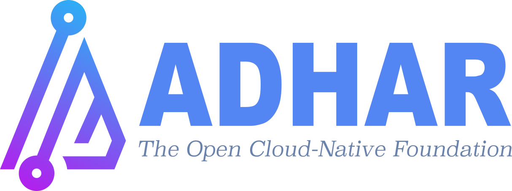

<div align="center">



**Sanskrit: अधार (Adhāra) – Foundation**

<h1>Open Foundation for Cloud-Native Platform Engineering</h1>

[](https://github.com/adhar-io/adhar/releases)
[](https://kubernetes.io)
[](https://www.crossplane.io)
[](https://golang.org)
[](LICENSE)
[](https://join.slack.com/t/adharworkspace/shared_invite/zt-26586j9sx-QGrIejNigvzGJrnyH~IXww)

</div>

---

## 🎯 What is Adhar?

**Adhar is an Open Internal Developer Platform that eliminates the trade-off between developer freedom and organizational governance.**

Traditional platforms force organizations to choose: either give developers freedom (leading to inconsistent architectures and security gaps) or enforce governance (creating bottlenecks and slowing teams down). Adhar takes a fundamentally different approach—**standardization as enablement, not constraint.**

Adhar delivers battle-tested architectural patterns with 50+ production-grade services—from Kubernetes and Cilium to ArgoCD, Vault, Prometheus, and beyond—all pre-configured, security-hardened, and ready to use. A single `adhar up` command provisions complete platforms across **AWS, Azure, GCP, DigitalOcean, Civo, or local Kind clusters in under 10 minutes**. No infrastructure tickets, no security reviews, no integration projects. Developers get instant self-service access to everything they need, while organizations get consistent, secure, compliant infrastructure enforced automatically through code.

**The result:** Teams spend 100% of their time on business value, zero time on undifferentiated infrastructure work. 100% open source (Apache 2.0) with no vendor lock-in. This is the foundation modern engineering teams deserve.

> ⚠️ **Development Status:** This project is in active development. APIs and configurations may change. Recommended for development and evaluation purposes.

---

## Platform Capabilities

| Capability | Description |
|------------|-------------|
| **📐 Standardized Architecture** | Organizational and application patterns that enforce best practices automatically |
| **🚀 Self-Service with Guardrails** | Instant provisioning within security/compliance boundaries - no approval workflows |
| **🎯 Golden Paths** | Pre-built patterns for microservices, microfrontends, data pipelines, and ML workflows |
| **🏗️ True Multi-Cloud** | Consistent experience across AWS, Azure, GCP, DigitalOcean, Civo, and Onprem |
| **🔄 GitOps Native** | Declarative infrastructure and application management via Git and ArgoCD |
| **🛡️ Security Built-In** | Zero-trust networking, secrets vault, vulnerability scanning, policy enforcement |
| **📊 Complete Observability** | Prometheus, Grafana, Loki, Tempo and Hubble configured with auto instrument |
| **🤖 AI/ML Platform** | Jupyter, analytics, ETL and pipeline orchestration ready for data teams |
| **📦 50+ Services Integrated** | From Kafka to databases - production-ready out-of-the-box services |

---

## 🚀 Quick Start

### Prerequisites

Before getting started, ensure you have:

| Requirement | Version | Purpose |
|-------------|---------|---------|
| **Docker** | v20.10+ | Container runtime |
| **kubectl** | v1.24+ | Kubernetes CLI |
| **RAM** | 8GB min, 16GB+ recommended | Platform resources |
| **Storage** | 20GB+ free | Images and data |
| **CPU** | 4+ cores | Processing power |


### Local Development (Under 5 Minutes)

```bash
#1. Install Adhar CLI
curl -fsSL https://raw.githubusercontent.com/adhar-io/adhar/scripts/install.sh | bash

#2. Create local cluster with core platform services
adhar up

#3. Access the platform, Adhar Console
open https://adhar.localtest.me

#4. Retrieve application secrets
adhar get secrets

#5. Check platform usage
adhar help

#6. Destroy Adhar platform
adhar down
```

### Production Environment

```bash
#1. Install Adhar CLI
curl -fsSL https://raw.githubusercontent.com/adhar-io/adhar/scripts/install.sh | bash

#2. Create configuration file (see Configuration Examples below)
cat > adhar-config.yaml <<EOF
clusterName: adhar-prod
provider: AWS_EKS  # Supports: AWS_EKS, GCP_GKE, AZURE_AKS, DIGITALOCEAN_DOKS, CIVO_K3S
region: us-east-1
enableHAMode: true

nodePools:
  - name: system
    instanceType: t3.large
    count: 3
    minCount: 3
    maxCount: 5
EOF

#3. Adhar platform production setup
adhar up -f adhar-config.yaml

#4. Verify deployment status
adhar get status

#5. Access the platform, Adhar Console
open https://cloud.adhar.io

#6. Get credentials for Adhar Console, ArgoCD, Gitea, Keycloak etc.
adhar get secrets -p argocd
```

---

## 📦 Integrated Tools (50+ Components)

<details>
<summary><b>Core Platform & Infrastructure (15)</b></summary>

- **Backstage** - Unified developer portal
- **Kubernetes** - Container orchestration platform
- **Kamaji** - Multi-tenant Kubernetes control plane
- **vCluster** - Virtual Kubernetes clusters
- **Open Cluster Management** - Multi-cluster orchestration
- **Sveltos** - Kubernetes add-on management
- **Crossplane** - Cloud-native Infrastructure as Code
- **ArgoCD** - GitOps continuous delivery
- **Gitea** - Self-hosted Git service
- **Cilium** - eBPF-based networking & security
- **Nginx Ingress** - HTTP/HTTPS traffic routing
- **External DNS** - Automated DNS management
- **Velero** - Backup & disaster recovery
- **Harbor** - Container registry & artifact repository
- **Armada** - Multi-cluster batch job scheduling

</details>

<details>
<summary><b>Security & Compliance (11)</b></summary>

- **Vault** - Secrets management & encryption
- **Keycloak** - Identity & access management
- **Kyverno** - Kubernetes policy engine
- **Falco** - Runtime threat detection
- **Trivy** - Vulnerability & security scanning
- **cert-manager** - Certificate lifecycle automation
- **Tetragon** - eBPF-based security observability
- **Cosign** - Container image signing & verification
- **External Secrets Operator** - External secrets synchronization
- **SPIFFE/SPIRE** - Workload identity & authentication
- **SealedSecrets** - Encrypted secrets for GitOps

</details>

<details>
<summary><b>Observability (16)</b></summary>

- **Prometheus** - Metrics collection & monitoring
- **Grafana** - Visualization & dashboards
- **Loki** - Log aggregation & querying
- **Tempo** - Distributed tracing backend
- **Jaeger** - Distributed tracing & analysis
- **Hubble** - Cilium network observability
- **AlertManager** - Alert routing & management
- **Grafana Mimir** - Scalable long-term metrics storage
- **OpenTelemetry** - Unified observability framework
- **Grafana Alloy** - OpenTelemetry collector distribution
- **FluentBit** - Lightweight log processor & forwarder
- **Pixie** - eBPF-based Kubernetes observability
- **Pyroscope** - Continuous profiling platform
- **Grafana Beyla** - eBPF application auto-instrumentation
- **Grafana Faro** - Real user monitoring for web apps
- **Grafana OnCall** - On-call management & incident response

</details>

<details>
<summary><b>Application Development & Delivery (22)</b></summary>

- **ArgoCD** - GitOps continuous delivery
- **Argo Workflows** - Container-native workflow engine
- **Argo Rollouts** - Progressive delivery with canary/blue-green
- **Argo Events** - Event-driven workflow automation
- **Gitea** - Self-hosted Git service
- **Harbor** - Container registry & artifact repository
- **Tekton** - Cloud-native CI/CD pipelines
- **FluxCD** - GitOps toolkit for Kubernetes
- **Knative** - Kubernetes-based serverless platform
- **OpenFaaS** - Functions as a Service framework
- **DAPR** - Distributed application runtime
- **Cilium Service Mesh** - eBPF-based service mesh
- **Cilium Gateway API** - Kubernetes Gateway API implementation
- **Coder** - Cloud development environments (CDE)
- **DevSpace** - Developer workflow automation
- **Kargo** - Freight promotion for GitOps
- **K6** - Modern load testing tool
- **ChaosMesh** - Chaos engineering platform
- **Penpot** - Open-source design & prototyping
- **Webstudio** - Visual web development platform
- **Plane** - Project management & issue tracking
- **Buildpacks** - Cloud-native buildpack support
</details>

<details>
<summary><b>Data & Analytics (14)</b></summary>

- **PostHog** - Product analytics & feature flags
- **Metabase** - Business intelligence dashboard
- **PostgreSQL** - Relational database
- **Valkey** - In-memory data store (Redis fork)
- **MinIO** - S3-compatible object storage
- **Kafka** - Distributed event streaming platform
- **Airbyte** - Data integration & ELT platform
- **Iceberg** - Open table format for data lakes
- **Kubeflow** - Machine learning workflows on Kubernetes
- **Dagster** - Data orchestration platform
- **MLflow** - ML lifecycle management platform
- **Flink** - Stream processing engine
- **OpenSearch** - Search & analytics engine
- **Milvus** - Vector database for AI applications

</details>

---

## 📚 Documentation

| Resource | Description |
|----------|-------------|
| [Documentation Home](docs/README.md) | Complete documentation index and navigation |
| [Getting Started Guide](docs/GETTING_STARTED.md) | Quick start and installation walkthrough |
| [User Guide](docs/USER_GUIDE.md) | Platform capabilities, configuration, and CLI reference |
| [Architecture Overview](docs/ARCHITECTURE.md) | System design, components, and technical details |
| [Provider Guide](docs/PROVIDER_GUIDE.md) | Multi-cloud provider implementation guide |
| [Advanced Guide](docs/ADVANCED.md) | HA mode, production deployment, and best practices |
| [Contributing Guide](CONTRIBUTING.md) | How to contribute to the Adhar project |

---

## 🤝 Community & Support

| Channel | Purpose | Link |
|---------|---------|------|
| 💬 **Slack** | Real-time chat & support | [Join Workspace](https://join.slack.com/t/adharworkspace/shared_invite/zt-26586j9sx-QGrIejNigvzGJrnyH~IXww) |
| 🐛 **GitHub Issues** | Bug reports & feature requests | [Open Issue](https://github.com/adhar-io/adhar/issues) |
| 📖 **Documentation** | Comprehensive guides | [docs/README.md](docs/README.md) |
| 💡 **Discussions** | Ideas, questions & feedback | [GitHub Discussions](https://github.com/adhar-io/adhar/discussions) |
| 📦 **Examples** | Sample configs & apps | [examples/](examples/) |

---

## 🤝 Contributing

We welcome contributions from the community! Here's how to get started:

### Development Setup

```bash
# Clone repository
git clone https://github.com/adhar-io/adhar.git
cd adhar

# Install dependencies
go mod download

# Build from source
make build

# Run tests
make test

# Run linter
make lint

# Test Adhar platform
./adhar up
```

### Contributing Guidelines

- **Code Contributions:** See our [Contributing Guide](CONTRIBUTING.md) for detailed instructions
- **Bug Reports:** Open an issue with detailed reproduction steps
- **Feature Requests:** Discuss new ideas in [GitHub Discussions](https://github.com/adhar-io/adhar/discussions)
- **Documentation:** Help improve our docs - PRs welcome!

---

## 🙏 Acknowledgments

Adhar is built on the shoulders of giants. We're grateful to the open-source community and the maintainers of these incredible projects:

<div align="center">

<table>
<tr>
<td align="center" width="20%">
<a href="https://kubernetes.io">

<br/><b>Kubernetes</b>
</a>
</td>
<td align="center" width="20%">
<a href="https://cilium.io">

<br/><b>Cilium</b>
</a>
</td>
<td align="center" width="20%">
<a href="https://argoproj.github.io">

<br/><b>ArgoCD</b>
</a>
</td>
<td align="center" width="20%">
<a href="https://crossplane.io">

<br/><b>Crossplane</b>
</a>
</td>
<td align="center" width="20%">
<a href="https://prometheus.io">

<br/><b>Prometheus</b>
</a>
</td>
</tr>
<tr>
<td align="center" width="20%">
<a href="https://grafana.com">

<br/><b>Grafana</b>
</a>
</td>
<td align="center" width="20%">
<a href="https://www.keycloak.org">

<br/><b>Keycloak</b>
</a>
</td>
<td align="center" width="20%">
<a href="https://www.vaultproject.io">

<br/><b>Vault</b>
</a>
</td>
<td align="center" width="20%">
<a href="https://goharbor.io">

<br/><b>Harbor</b>
</a>
</td>
<td align="center" width="20%">
<a href="https://gitea.io">

<br/><b>Gitea</b>
</a>
</td>
</tr>
<tr>
<td align="center" width="20%">
<a href="https://aquasecurity.github.io/trivy">

<br/><b>Trivy</b>
</a>
</td>
<td align="center" width="20%">
<a href="https://falco.org">

<br/><b>Falco</b>
</a>
</td>
<td align="center" width="20%">
<a href="https://kyverno.io">

<br/><b>Kyverno</b>
</a>
</td>
<td align="center" width="20%">
<a href="https://cert-manager.io">

<br/><b>cert-manager</b>
</a>
</td>
<td align="center" width="20%">
<a href="https://helm.sh">

<br/><b>Helm</b>
</a>
</td>
</tr>
</table>

<p><i>...and many more incredible open-source projects that make cloud-native possible.</i></p>

</div>

---

<div align="center">

### ⭐ Star us on GitHub — it helps the project grow!

**Adhar Platform v0.3.8** • Built with ❤️ for Developers

[🎯 Get Started](docs/GETTING_STARTED.md) • [💬 Join Slack](https://join.slack.com/t/adharworkspace/shared_invite/zt-26586j9sx-QGrIejNigvzGJrnyH~IXww) • [📖 Documentation](docs/README.md) • [🤝 Contribute](CONTRIBUTING.md) • [🐛 Report Issue](https://github.com/adhar-io/adhar/issues)

---

© 2025 Adharlabs Pte Ltd • Licensed under [Apache License 2.0](LICENSE)

</div>
