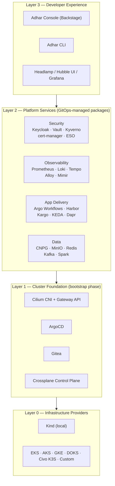
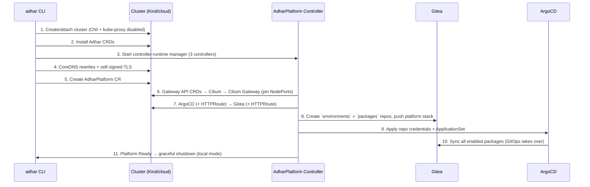
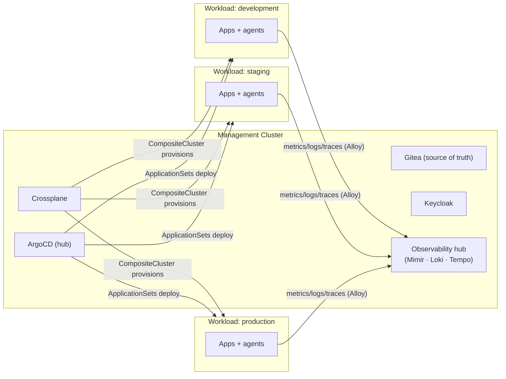

# Adhar Platform Architecture

**Version**: v0.1.0 · **Status**: Living document · **Audience**: platform engineers, contributors, and adopters evaluating Adhar

This is the definitive description of how Adhar is designed and why. It covers the architecture as implemented today, the production topology it is designed to grow into, and the extension points that make the platform customizable without forking. Decisions with lasting consequences are recorded as [Architecture Decision Records](adr/README.md).

---

## 1. Goals and Non-Goals

Adhar's goal is to be the **open foundation for platform engineering**: one command (`adhar up`) produces a complete, production-grade Internal Developer Platform built entirely from open-source components, on any of six providers or a local machine.

**Goals**

- **Standardization as enablement** — golden paths and pre-integrated services, not restrictions
- **Self-service with guardrails** — developers provision within policy boundaries; no tickets
- **GitOps as the only write path** — after bootstrap, every change flows through Git
- **Multi-cloud symmetry** — identical platform experience on AWS, Azure, GCP, DigitalOcean, Civo, and Kind
- **Customization without forking** — every layer has a supported extension point
- **100% open source** — Apache 2.0, no proprietary control plane, no phone-home

**Non-Goals**

- Adhar is not a managed service or SaaS control plane — you run it, you own it
- Adhar does not abstract Kubernetes away — it curates and integrates, but `kubectl` always works
- Adhar does not invent new primitives where CNCF standards exist (Gateway API, OCI, OIDC, OpenTelemetry)

## 2. Design Principles

1. **Management Cluster First.** A single management cluster is the source of truth. It hosts the Git server, GitOps engine, and the Crossplane control plane that provisions and governs everything else — including other clusters.
2. **Two-phase deployment: bootstrap imperatively, operate declaratively.** A minimal, deterministic imperative sequence stands up just enough platform (CNI → Gateway → GitOps engine → Git server) for GitOps to take over. Everything after that is reconciled from Git. ([ADR-0001](adr/0001-management-cluster-first.md), [ADR-0006](adr/0006-embedded-bootstrap-manifests.md))
3. **The platform is data, not code.** Platform content (packages, environments) lives as declarative YAML in Git repositories, rendered ahead of time. Changing the platform means changing data — no Go changes, no rebuilds.
4. **Standards over frameworks.** Gateway API for routing, OIDC for identity, OCI for artifacts, Kubernetes CRDs for APIs. Components are replaceable because the seams are standard.
5. **Secure by default, permissive by exception.** Zero-trust networking, policy enforcement, and non-root workloads are the baseline; exceptions are explicit, reviewable Git changes.
6. **Everything observable.** Metrics, logs, traces, profiles, and network flows are first-class platform outputs, not add-ons.
7. **Local–production parity.** The Kind-based local platform runs the same controllers, the same GitOps flow, and the same package model as production — smaller, not different.

## 3. System Overview

The platform is organized in four layers. Each layer only depends on the layer below it, and each has a defined customization surface (§9).



| Layer | What it is | Managed by | Customization surface |
|-------|-----------|------------|----------------------|
| **L0 Infrastructure** | Clusters, networks, load balancers, storage | Provider interface + Crossplane | Provider implementations, Crossplane Compositions |
| **L1 Foundation** | CNI, Gateway, GitOps engine, Git server, control plane | AdharPlatform controller (embedded manifests) | Helm values in `hack/`, AdharPlatform CR spec |
| **L2 Platform Services** | 69+ packages across security, observability, data, delivery | ArgoCD ApplicationSet from Gitea | Package toggles, values, custom packages |
| **L3 Developer Experience** | Console, CLI, dashboards, golden-path templates | GitOps packages + CLI releases | Templates, Backstage plugins, CLI config |

## 4. Deployment Lifecycle

### Phase 1 — Bootstrap (imperative, deterministic)

`adhar up` executes a strictly ordered sequence. Order matters: each step provides the substrate for the next, and the sequence is identical on every provider ([ADR-0006](adr/0006-embedded-bootstrap-manifests.md)).



The bootstrap manifests (Cilium, Gateway, ArgoCD, Gitea, Crossplane) are **embedded in the binary** via `go:embed` and applied with Server-Side Apply (`ForceOwnership`) — bootstrap has no network dependency on chart repositories and no external `kubectl`.

### Phase 2 — GitOps (declarative, continuous)

After bootstrap, the in-cluster Gitea instance holds two repositories that are the platform's source of truth:

| Repository | Content | Consumed by |
|------------|---------|-------------|
| `adhar/packages` | 87 package directories: pre-rendered manifests (`manifests/install.yaml`), `values.yaml`, `generate-manifests.sh` | ArgoCD ApplicationSet |
| `adhar/environments` | Per-environment configuration (`local`, `development`, `testing`, `staging`, `production`) | ApplicationSet generators, controllers |

A single ArgoCD **ApplicationSet** wires all packages using a list generator: every package is declared with `name`, `namespace`, `category`, `manifestPath`, and an `enabled` flag; a selector deploys only `enabled: "true"` entries ([ADR-0004](adr/0004-applicationset-package-model.md)). Locally a curated core (~16 packages) is enabled; production environments enable more. Enabling a package is a one-line Git change.

### Reconciliation model

Three controllers (controller-runtime, KubeBuilder v4) own the platform's CRDs in API group `platform.adhar.io/v1alpha1`:

| Controller | CRD | Responsibility |
|------------|-----|----------------|
| **AdharPlatform** | `AdharPlatform` | Lifecycle of foundation components (Cilium, Gateway, ArgoCD, Gitea, Crossplane); GitOps repo setup; component health in `.status` |
| **GitRepository** | `GitRepository` | Git repos across providers (Gitea, GitHub, GitLab, Bitbucket) from local, remote, or embedded sources |
| **CustomPackage** | `CustomPackage` | User workloads delivered as ArgoCD Applications/ApplicationSets through Gitea |

In local mode the manager runs in the CLI process and exits when the platform is `Deployed`; in production mode the same manager runs **in-cluster** so reconciliation is continuous (§8).

## 5. Infrastructure & Control Plane

### Provider abstraction

`platform/providers/interface.go` defines one interface covering cluster CRUD, node groups, VPC/networking, load balancers, storage, health, metrics, cost, and addons. Implementations exist for AWS, Azure, GCP, DigitalOcean, Civo, Kind, and Custom (bring-your-own-cluster), instantiated through a factory. The interface is the **imperative** path — used for day-0 cluster creation and day-2 cluster operations from the CLI.

### Crossplane control plane

The **declarative** infrastructure path is a Crossplane v2 control plane (`platform/controlplane/`), packaged as a Configuration `.xpkg`:

- **23 XRDs** (`apiextensions.crossplane.io/v2`, `scope: Namespaced`) define platform APIs: `CompositeCluster`, `CompositeApplication`, `CompositeDatabase`, `CompositeNetwork`, `CompositeEnvironment`, `CompositePlatformConfig`, …
- **34 Compositions** (Pipeline mode) implement them per provider family — AWS/Azure/GCP via Upbound v2 managed resources (namespaced `.m` API groups), plus Kubernetes-native compositions via provider-kubernetes and provider-helm
- **5 composition functions** — KCL, Go-templating, patch-and-transform, auto-ready, Python
- **Operations** — CronOperations (scheduled backup, secret rotation) and WatchOperations (drift response)

This gives teams a namespaced, multi-tenant-safe API: a developer requests a `CompositeDatabase` in their namespace; the composition provisions CNPG locally or RDS/CloudSQL in the cloud — same API, provider-appropriate implementation. See [ADR-0005](adr/0005-crossplane-v2-namespaced.md) and `platform/controlplane/CONVENTIONS.md`.

**Install order** (enforced by the controller): Crossplane core → XRDs → Compositions → Functions → ProviderConfigs → Operations.

## 6. Networking

### Data path

Cilium is the CNI in **kube-proxy replacement** mode — eBPF handles service load-balancing, network policy, and observability (Hubble). Cilium also implements **Gateway API**, so north-south routing needs no separate ingress controller ([ADR-0002](adr/0002-cilium-cni-and-gateway.md)).

- **GatewayClass** `adhar`, **Gateway** `adhar-gateway` in `adhar-system`
- Every UI-bearing package ships an `HTTPRoute` attaching to the shared Gateway: `argocd.<domain>`, `gitea.<domain>`, `console.<domain>`, …
- TLS terminates at the Gateway (self-signed locally; cert-manager-issued in production)

**Local traffic path** (default domain `adhar.localtest.me`, wildcard-resolves to 127.0.0.1):

```text
Browser :8443 ──▶ Kind hostPort ──▶ NodePort 30443 (pinned) ──▶ Cilium Envoy (Gateway) ──▶ HTTPRoute ──▶ Service
```

The controller pins the generated Gateway Service node ports (30080/30443) so Kind's static host-port mapping stays valid across reconciles.

**Production traffic path**:

```text
DNS (external-dns) ──▶ Cloud LB (provider-managed) ──▶ Gateway Service (LoadBalancer) ──▶ Cilium Envoy ──▶ HTTPRoute ──▶ Service
```

Same Gateway, same HTTPRoutes — only the Service type and certificate issuer differ per environment.

### East-west and cluster mesh

- **Default-deny posture** via Cilium network policies per namespace (rolled out progressively; see [Production Guide](PRODUCTION.md))
- **Transparent encryption** (WireGuard) for node-to-node traffic in production
- **Cilium Cluster Mesh** connects management and workload clusters for cross-cluster service discovery without a heavyweight service mesh; Cilium's mTLS/SPIFFE integration is the forward path for workload identity

## 7. Security Architecture

Security is layered so that each concern has exactly one owning component, and all of them arrive as ordinary packages:

| Concern | Component | How it's wired |
|---------|-----------|----------------|
| **Identity & SSO** | Keycloak | OIDC provider for ArgoCD, Gitea, Grafana, Console; group claims map to RBAC |
| **Secrets** | External Secrets Operator + Vault | ESO syncs from Vault (or cloud secret managers) into Kubernetes Secrets; no secrets in Git |
| **Certificates** | cert-manager | ACME/Let's Encrypt or private CA; issues the Gateway certificate in production |
| **Policy** | Kyverno + kyverno-policies | Validate/mutate/generate; baseline Pod Security, image provenance, label governance |
| **Supply chain** | Harbor + Trivy + Cosign | Private registry, image scanning, signature verification enforced by policy |
| **Runtime** | Falco + Tetragon | Syscall and eBPF-based runtime detection |
| **Network** | Cilium policies + Hubble | Microsegmentation with flow-level audit evidence |

**Trust bootstrap**: bootstrap generates a self-signed CA and wires CoreDNS rewrites so the platform is TLS-everywhere from the first minute even offline; production replaces the issuer with cert-manager without changing any HTTPRoute.

**Defaults**: distroless/non-root images for Adhar's own components, `adhar.io/*` labels for ownership tracking, Server-Side Apply field ownership for drift attribution, DCO + signed releases (SHA-256 checksums) for provenance.

## 8. Topologies: Local and Production

The same architecture deploys at three sizes. This is a deliberate spectrum, not separate products — promotion between them is configuration, not re-architecture.

### T1 — Local (default today)

Single Kind cluster; controllers run in the CLI process and exit after deployment; curated package core; self-signed TLS. Optimized for < 10 minutes to a working platform on a laptop.

### T2 — Single-cluster production

One managed cluster (EKS/AKS/GKE/DOKS/Civo) runs both the platform and workloads:

- Controllers run **in-cluster** as a Deployment (continuous reconciliation, self-healing)
- HA mode: 3 control-plane nodes, ≥ 2 replicas for ArgoCD/Gitea/Gateway, PodDisruptionBudgets, topology-spread across zones
- Stateful services (Gitea, Keycloak, Harbor) back onto CNPG-managed PostgreSQL with streaming replication; object storage (MinIO or cloud-native) for artifacts and backups
- cert-manager + external-dns automate the edge; Velero backs up cluster state and volumes

### T3 — Management + workload clusters (target production topology)



- The management cluster is the only place humans and CI push to; workload clusters are **cattle** — fully reconstructable from Git + Crossplane
- Workload clusters run a minimal agent footprint (Cilium, Alloy collectors, policy engines); heavy multi-tenant services stay on the management cluster
- Environment promotion (dev → staging → prod) is Git promotion, optionally orchestrated by Kargo
- Blast-radius isolation: a workload cluster outage never takes down the control plane, and vice versa the platform degrades to "no changes" — running apps keep running

Full HA sizing, backup/DR procedures, and hardening steps live in the [Production Guide](PRODUCTION.md).

## 9. Extensibility & Customization Model

Every supported customization maps to one of these extension points — if something can only be changed by patching Go code, that is an architecture bug worth filing. The [Customization Guide](CUSTOMIZATION.md) walks through each with examples.

| # | Extension point | Mechanism | Typical use |
|---|----------------|-----------|-------------|
| 1 | **Package toggles** | `enabled` flag in ApplicationSet / environment config | Turn any of the 69 wired packages on or off per environment |
| 2 | **Package values** | `values.yaml` + `generate-manifests.sh` per package | Pin versions, resize resources, change chart options |
| 3 | **New packages** | Drop a directory under `packages/<category>/`, add one ApplicationSet entry | Bring your own chart or manifests into the same GitOps flow |
| 4 | **Custom applications** | `CustomPackage` CRD / `examples/*.yaml` | Team workloads deployed via the platform's ArgoCD |
| 5 | **Environments** | `environments/<name>/config.yaml` + templates in `config.yaml` | New environments inheriting from prod/nonprod defaults |
| 6 | **Platform config** | Four-layer `config.yaml` (globalSettings → providers → environmentTemplates → environments) | Domains, ports, HA mode, provider credentials |
| 7 | **Infrastructure APIs** | Crossplane XRDs + Compositions | New self-service APIs (queues, caches, buckets) or new implementations of existing ones |
| 8 | **Providers** | Implement `providers.Provider` interface + factory registration | New cloud/on-prem targets |
| 9 | **Foundation tuning** | Helm values in `hack/` + regenerated embedded manifests | Cilium/ArgoCD/Gitea base configuration (platform-developer level) |

Guarantees that make customization safe:

- **Additive first**: new packages and XRDs never require modifying shipped ones
- **Git-reviewable**: every customization (1–7) is a plain Git diff in Gitea — auditable, revertible, promotable
- **Upgrade-tolerant**: user packages live beside, not inside, Adhar-shipped package directories; `enabled` flags and environment configs survive stack updates

## 10. Observability

- **Collection**: Grafana Alloy (OTel-native) ships metrics, logs, and traces; Beyla/Pixie offer eBPF auto-instrumentation without code changes
- **Storage**: Prometheus (+ Mimir for long-term/multi-cluster), Loki (logs), Tempo (traces) — object-storage-backed in production
- **Network**: Hubble exposes flow-level visibility from the Cilium data path
- **Cost & operations**: OpenCost for spend attribution; Grafana OnCall for alert routing; metrics-server for autoscaling signals
- **Platform self-observability**: controllers expose reconcile metrics; ArgoCD sync status is surfaced by `adhar get status` and the Console

In topology T3, workload clusters run only collectors; the management cluster hosts the storage/query hub — one pane of glass across every environment.

## 11. Quality Attributes

| Attribute | Architectural answer |
|-----------|---------------------|
| **Reliability** | GitOps reconciliation self-heals drift; controllers are level-triggered and idempotent (SSA); HA replicas + PDBs in production |
| **Recoverability** | Everything is Git + backups: re-run bootstrap, restore Gitea + Velero volumes → platform reconverges (RTO/RPO targets in [Production Guide](PRODUCTION.md)) |
| **Scalability** | Package fan-out is ArgoCD-native; multi-cluster scale-out via T3; eBPF data path avoids iptables-scale limits |
| **Portability** | Provider interface + Crossplane Compositions keep 100% of the platform definition provider-neutral |
| **Security** | Zero-trust defaults, single-owner security components, no secrets in Git, signed artifacts |
| **Operability** | One CLI, one status surface, deterministic bootstrap, uniform labels (`adhar.io/*`) for every managed object |
| **Evolvability** | Extension points (§9) + ADRs; components replaceable at standard seams (Gateway API, OIDC, OTel, OCI) |

## 12. Architecture Decision Records

| ADR | Decision |
|-----|----------|
| [ADR-0001](adr/0001-management-cluster-first.md) | Management-cluster-first with two-phase bootstrap |
| [ADR-0002](adr/0002-cilium-cni-and-gateway.md) | Cilium as CNI, kube-proxy replacement, and Gateway API implementation |
| [ADR-0003](adr/0003-in-cluster-gitea.md) | Self-hosted in-cluster Gitea as the platform's source of truth |
| [ADR-0004](adr/0004-applicationset-package-model.md) | Single ApplicationSet with enabled-gated package list |
| [ADR-0005](adr/0005-crossplane-v2-namespaced.md) | Crossplane v2 namespaced XRs for self-service infrastructure |
| [ADR-0006](adr/0006-embedded-bootstrap-manifests.md) | Embedded, pre-rendered manifests for bootstrap |
| [ADR-0007](adr/0007-dual-provisioning-paths.md) | Dual provisioning paths: imperative provider interface + declarative Crossplane |
| [ADR-0008](adr/0008-keycloak-platform-identity.md) | Keycloak as the platform identity provider (OIDC everywhere) |
| [ADR-0009](adr/0009-secrets-eso-vault.md) | Secrets: ESO as sync plane, Vault as source of truth, never Git |
| [ADR-0010](adr/0010-observability-lgtm-otel.md) | Observability: OTel collection, Grafana LGTM storage, hub-and-spoke |

## 13. Related Documents

- [Control Plane In Depth](CONTROL_PLANE.md) — the Crossplane v2 control plane: how it's built, integrated, and operated
- [Roadmap](ROADMAP.md) — phased path from today's implementation to the full T3 production topology
- [Production Guide](PRODUCTION.md) — HA, hardening, backup/DR, upgrades
- [Customization Guide](CUSTOMIZATION.md) — hands-on walkthroughs of every extension point
- [Provider Guide](PROVIDER_GUIDE.md) — per-cloud specifics and adding new providers
