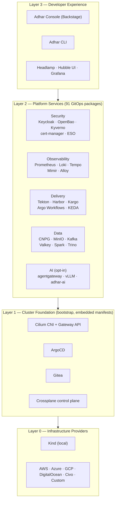
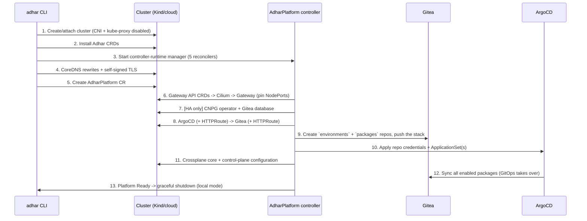
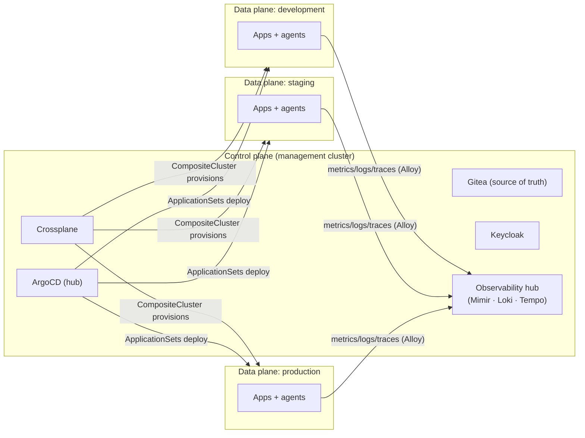
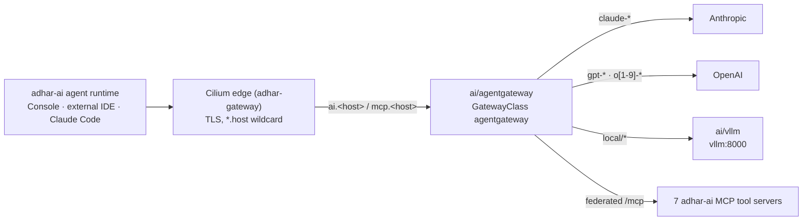

# Adhar Platform Architecture

**Status**: Living document · **Audience**: platform engineers, contributors, adopters evaluating Adhar · **Verified**: 2026-09

This is the definitive description of how Adhar is designed and why, as implemented today. Read it to answer:

- *What happens when I run `adhar up`?* → [§4](#4-deployment-lifecycle)
- *What ships in the platform, and where does it run?* → [§4.3](#43-the-package-catalogue), [§5](#5-infrastructure--control-plane)
- *How do requests reach a service, and how is it secured?* → [§6](#6-networking), [§7](#7-security-architecture)
- *How do I change the platform without forking it?* → [§9](#9-extensibility--customization-model)
- *What is actually proven to work, and where?* → [§8](#8-topologies-and-verification-status)

Decisions with lasting consequences are recorded as [Architecture Decision Records](adr/README.md); low-level as-built mechanics live in the [design docs](design/README.md).

---

## Table of Contents

1. [Goals and Non-Goals](#1-goals-and-non-goals)
2. [Design Principles](#2-design-principles)
3. [System Overview](#3-system-overview)
4. [Deployment Lifecycle](#4-deployment-lifecycle)
5. [Infrastructure & Control Plane](#5-infrastructure--control-plane)
6. [Networking](#6-networking)
7. [Security Architecture](#7-security-architecture)
8. [Topologies and Verification Status](#8-topologies-and-verification-status)
9. [Extensibility & Customization Model](#9-extensibility--customization-model)
10. [The AI Layer](#10-the-ai-layer)
11. [Observability](#11-observability)
12. [Quality Attributes](#12-quality-attributes)
13. [Decisions and Related Documents](#13-decisions-and-related-documents)

---

## 1. Goals and Non-Goals

Adhar's goal is to be the **open foundation for platform engineering**: one command (`adhar up`) produces a complete, production-grade Internal Developer Platform built entirely from open-source components, on any of six providers or a local machine.

| Goals | Non-Goals |
|---|---|
| **Standardization as enablement** — golden paths, not restrictions | Not a managed service or SaaS control plane — you run it, you own it |
| **Self-service with guardrails** — developers provision within policy, no tickets | Does not abstract Kubernetes away — `kubectl` always works |
| **GitOps as the only write path** — after bootstrap, every change flows through Git | Does not invent primitives where CNCF standards exist (Gateway API, OCI, OIDC, OTel) |
| **Multi-cloud symmetry** — same platform on AWS, Azure, GCP, DigitalOcean, Civo, Kind | No proprietary control plane, no phone-home |
| **Customization without forking** — every layer has a supported extension point | |
| **100% open source** — Apache 2.0 throughout | |

The open-source commitment is load-bearing, not decorative: HashiCorp Vault (BUSL-1.1) was replaced in the production profile by **OpenBao** (MPL-2.0) for exactly this reason ([§7](#7-security-architecture)).

## 2. Design Principles

1. **Management Cluster First.** One management cluster is the source of truth. It hosts the Git server, GitOps engine, and the Crossplane control plane that provisions everything else — including other clusters. ([ADR-0001](adr/0001-management-cluster-first.md))
2. **Bootstrap imperatively, operate declaratively.** A minimal, deterministic imperative sequence stands up just enough platform for GitOps to take over. Everything after that is reconciled from Git. ([ADR-0006](adr/0006-embedded-bootstrap-manifests.md))
3. **The platform is data, not code.** Packages and environments are declarative YAML in Git, pre-rendered. Changing the platform means changing data — no Go changes, no rebuilds.
4. **Standards over frameworks.** Gateway API for routing, OIDC for identity, OCI for artifacts, CRDs for APIs, MCP for agent tooling. Components are replaceable because the seams are standard.
5. **Secure by default, permissive by exception.** Zero-trust networking, policy enforcement, and non-root workloads are the baseline; exceptions are explicit, reviewable Git changes.
6. **Everything observable.** Metrics, logs, traces, profiles, network flows — and now AI token spend — are first-class platform outputs.
7. **Local–production parity.** The Kind platform runs the same controllers, the same GitOps flow, and the same package model as production — smaller, not different.

## 3. System Overview

Four layers. Each depends only on the layer below, and each has a defined customization surface ([§9](#9-extensibility--customization-model)).

```mermaid
flowchart TB
    subgraph L3["Layer 3 — Developer Experience"]
        console["Adhar Console (Backstage)"]
        cli["Adhar CLI"]
        ui["Headlamp · Hubble UI · Grafana"]
    end
    subgraph L2["Layer 2 — Platform Services (91 GitOps packages)"]
        sec["Security<br/>Keycloak · OpenBao · Kyverno<br/>cert-manager · ESO"]
        obs["Observability<br/>Prometheus · Loki · Tempo<br/>Mimir · Alloy"]
        app["Delivery<br/>Tekton · Harbor · Kargo<br/>Argo Workflows · KEDA"]
        data["Data<br/>CNPG · MinIO · Kafka<br/>Valkey · Spark · Trino"]
        ai["AI (opt-in)<br/>agentgateway · vLLM · adhar-ai"]
    end
    subgraph L1["Layer 1 — Cluster Foundation (bootstrap, embedded manifests)"]
        cilium["Cilium CNI + Gateway API"]
        argocd["ArgoCD"]
        gitea["Gitea"]
        xp["Crossplane control plane"]
    end
    subgraph L0["Layer 0 — Infrastructure Providers"]
        kind["Kind (local)"]
        clouds["AWS · Azure · GCP · DigitalOcean · Civo · Custom"]
    end
    L3 --> L2 --> L1 --> L0
```

| Layer | What it is | Managed by | Customization surface |
|-------|-----------|------------|----------------------|
| **L0 Infrastructure** | Clusters, networks, load balancers, storage | Provider interface + Crossplane | Provider implementations, Compositions |
| **L1 Foundation** | CNI, Gateway, GitOps engine, Git server, control plane | AdharPlatform controller (embedded manifests) | Helm values in `hack/`, `AdharPlatform` spec |
| **L2 Platform Services** | 91 packages across seven categories ([§4.3](#43-the-package-catalogue)) | ArgoCD ApplicationSet from Gitea | Package toggles, values, custom packages |
| **L3 Developer Experience** | Console, CLI, dashboards, golden-path templates | GitOps packages + CLI releases | Templates, Backstage plugins, CLI config |

## 4. Deployment Lifecycle

### 4.1 Phase 1 — Bootstrap (imperative, deterministic)

`adhar up` executes a strictly ordered sequence. Order matters: each step provides the substrate for the next, and the sequence is identical on every provider ([ADR-0006](adr/0006-embedded-bootstrap-manifests.md)).

```mermaid
sequenceDiagram
    participant CLI as adhar CLI
    participant K8s as Cluster (Kind/cloud)
    participant Ctl as AdharPlatform controller
    participant Git as Gitea
    participant Argo as ArgoCD

    CLI->>K8s: 1. Create/attach cluster (CNI + kube-proxy disabled)
    CLI->>K8s: 2. Install Adhar CRDs
    CLI->>Ctl: 3. Start controller-runtime manager (5 reconcilers)
    CLI->>K8s: 4. CoreDNS rewrites + self-signed TLS
    CLI->>K8s: 5. Create AdharPlatform CR
    Ctl->>K8s: 6. Gateway API CRDs -> Cilium -> Gateway (pin NodePorts)
    Ctl->>K8s: 7. [HA only] CNPG operator + Gitea database
    Ctl->>K8s: 8. ArgoCD (+ HTTPRoute) -> Gitea (+ HTTPRoute)
    Ctl->>Git: 9. Create `environments` + `packages` repos, push the stack
    Ctl->>Argo: 10. Apply repo credentials + ApplicationSet(s)
    Ctl->>K8s: 11. Crossplane core + control-plane configuration
    Argo->>Git: 12. Sync all enabled packages (GitOps takes over)
    Ctl->>CLI: 13. Platform Ready -> graceful shutdown (local mode)
```

Two ordering facts are deliberate and worth knowing:

- **CNPG joins the foundation only in HA mode**, ahead of Gitea, so Gitea's database can be a replicated CNPG cluster. In non-HA mode Gitea uses its bundled database and `data/cnpg` arrives later as an ordinary package.
- **Crossplane is reconciled _after_ the ApplicationSet is applied.** Its control-plane convergence is slow and retry-prone; gating the ApplicationSet behind it was the failure that left ArgoCD empty on interrupted runs. Applications never wait on Crossplane.

Bootstrap manifests (Cilium, Gateway API, Gateway, CNPG, ArgoCD, Gitea, Crossplane) are **embedded in the binary** via `go:embed` and applied with Server-Side Apply (`ForceOwnership`) — no chart repository, no external `kubectl`. Pinned versions today:

| Component | Version | Source |
|---|---|---|
| Kubernetes (default) | `v1.37.0` | `globals.DefaultKubernetesVersion`; `adhar up --kube-version` overrides on **every** provider, then the environment's `clusterConfig`, then this default |
| Cilium | `v1.20.0` | `platform/controllers/adharplatform/resources/cilium/` |
| ArgoCD | `v3.5.1` (chart 10.3.3) | `.../resources/argocd/` |
| Gitea | `1.27.0` (chart 12.7.0) | `.../resources/gitea/` |
| Crossplane | `v2.3.1` | `.../resources/crossplane/` |

A worker added later by `adhar cluster scale` or the node autoscaler takes its version from the **running control plane**, so a scaled cluster cannot skew.

### 4.2 Phase 2 — GitOps (declarative, continuous)

After bootstrap, the in-cluster Gitea holds the two repositories that are the platform's source of truth:

| Repository | Content | Consumed by |
|------------|---------|-------------|
| `adhar/packages` | One directory per package: pre-rendered `manifests/`, `values.yaml`, `generate-manifests.sh`, `adhar-package.yaml` (marketplace contract) | ArgoCD ApplicationSet |
| `adhar/environments` | Per-environment configuration (`local`, `development`, `testing`, `staging`, `production`) | ApplicationSet generators, controllers |

The platform ApplicationSet is **selected by provider** ([`appSetFileForProvider`](../platform/controllers/adharplatform/controller.go)): Kind (or unset) gets `adhar-appset-local.yaml`; every cloud/on-prem provider gets `adhar-appset-production.yaml`. A third, `adhar-appset-workload.yaml`, is applied unconditionally and generates nothing until workload clusters register ([§8](#8-topologies-and-verification-status)).

Each ApplicationSet wires every package as a list element with `name`, `namespace`, `category`, `manifestPath` and an `enabled` flag; a selector deploys only `enabled: "true"` entries ([ADR-0004](adr/0004-applicationset-package-model.md)). Enabling a package is a one-line Git change. The ApplicationSet is re-applied on **every** reconcile with a local stack directory — gating it on "repos already exist" was the original flaw that left ArgoCD empty after a re-run.

### 4.3 The package catalogue

**91 deployable packages** (each carrying an `adhar-package.yaml` contract) are wired as **94 ApplicationSet elements** — three packages ship more than one variant: `supply-chain-policies` (audit / enforce) and `vllm` (shared surface / CPU / GPU).

| Category | Packages | Elements | Enabled in production | Enabled in the local core |
|---|---:|---:|---:|---:|
| `ai` | 3 | 5 | 0 | 0 |
| `application` | 26 | 26 | 22 | 10 |
| `core` | 6 | 6 | 4 | 1 |
| `data` | 22 | 22 | 22 | 6 |
| `infrastructure` | 2 | 2 | 2 | 0 |
| `observability` | 16 | 16 | 13 | 8 |
| `security` | 16 | 17 | 13 | 7 |
| **Total** | **91** | **94** | **76** | **32** |

Directory counts under `platform/stack/packages/` are slightly higher than the package counts: `application/adhar-templates` is a scaffolder template collection, four `SKIPPED.md` placeholders (`backup/velero`, `application/{strapi,tldraw,webstudio}`) and three empty directories (`application/pyroscope`, `core/amarda`, `data/dbt`) carry no contract and are not deployed. Every disabled entry in `adhar-appset-production.yaml` carries its reason inline.

### 4.4 One namespace, one exception

Every platform package installs into **`adhar-system`** — the same namespace as the bootstrap foundation — with exactly one exception: **`buildpack` (kpack) keeps `kpack-system`** ([ADR-0011](adr/0011-shared-platform-namespace.md)). kpack's webhook and cosign's policy-controller both hardcode `Secret/webhook-certs` in their binaries, and two knative webhooks cannot share it; a name a binary hardcodes cannot be fixed by renaming the manifest, so the smaller package keeps its own namespace. Those are the only two destination namespaces in the ApplicationSets (93 elements + 1).

The only other namespaces the platform creates are **Kargo `Project` namespaces** (`adhar-environments`, where the namespace *is* the Project) and **data-plane vclusters** (`dp-<name>`). Application environments get their own namespaces — that is the boundary that matters; platform components do not need one.

Sharing one namespace has two standing consequences, both platform invariants:

| Failure class | Mechanism | Rule |
|---|---|---|
| **Object-name collisions** | Two packages defining the same `kind/name` fight over ArgoCD ownership and flap forever | Rename in the generator where the name is configurable; otherwise the pair is mutually exclusive (`vault` ↔ `openbao`) or split by namespace (`cosign` ↔ `buildpack`) |
| **Service-link env collisions** | Kubernetes injects a `<NAME>_PORT` variable for every Service in the namespace. cosign's `Service/webhook` becomes `WEBHOOK_PORT=tcp://<ip>:443`, which crashes any pod that decodes env strictly — observed on crossplane (`--webhook-port`) and chaos-mesh's dashboard | Set **`enableServiceLinks: false`** on any component that reads configuration from env vars |

The authoritative collision register, with a scan script to run before wiring a new package, is [`platform/stack/packages/CONFLICTS.md`](../platform/stack/packages/CONFLICTS.md).

### 4.5 Reconciliation model

The controller-runtime manager registers **five reconcilers**; four own CRDs in API group `platform.adhar.io/v1alpha1`, and the fifth watches only core types.

| Reconciler | CRD | Responsibility |
|------------|-----|----------------|
| **AdharPlatform** | `AdharPlatform` | Foundation lifecycle (Cilium, Gateway, CNPG, ArgoCD, Gitea, Crossplane), GitOps repo setup, ApplicationSet apply, clustermesh-apiserver, component health in `.status` |
| **GitRepository** | `GitRepository` | Git repos across providers (Gitea, GitHub, GitLab, Bitbucket) from local, remote, or embedded sources |
| **CustomPackage** | `CustomPackage` | User workloads delivered as ArgoCD Applications/ApplicationSets through Gitea |
| **DataPlane** | `DataPlane` | Registers and governs workload clusters: ArgoCD registration, thin-agent profile, Cilium mesh, telemetry wiring; rolls `FleetStatus` up onto `AdharPlatform` |
| **Node autoscaler** | — (watches Pods/Nodes) | Scales raw-compute node pools up on unschedulable pods and down when idle; no-ops unless the `AdharPlatform` enables autoscaling |

In local mode the manager runs in the CLI process and exits when the platform is `Deployed`; in production the same manager runs **in-cluster**, so reconciliation is continuous.

### 4.6 Bootstrap resilience

Each phase is gated on an end-of-phase flag on `AdharPlatform.status`, making bootstrap **all-or-retry** and resumable:

- **Idempotent foundation** — every installer is Server-Side Apply with force ownership, so re-running (or re-entering after a partial failure) is always safe.
- **GitOps phase gated on `RepositoriesCreated`** — repo creation is 409-tolerant and population is a force push, so re-entry re-applies the stack idempotently; ArgoCD auth and the ApplicationSet re-apply unconditionally.
- **Verify-before-exit** — the shutdown gate confirms the ApplicationSet *and* the `gitea-argocd` repo-auth Service exist before `adhar up` reports success, and the Crossplane control plane must be fully applied before local mode may exit.

Full mechanics — reconcile pipeline, status gates, failure/recovery matrix — are in [design/0001 §4.1, §6.1, §9](design/0001-management-cluster-first.md). Operator-facing signatures are in [Troubleshooting](TROUBLESHOOTING.md).

## 5. Infrastructure & Control Plane

Two paths provision infrastructure, deliberately ([ADR-0007](adr/0007-dual-provisioning-paths.md)):

| Path | Surface | Used for |
|---|---|---|
| **Imperative** | `platform/providers/interface.go` — one Go interface covering cluster CRUD, node groups, VPC/networking, load balancers, storage, health, metrics, cost, addons. Implementations: AWS, Azure, GCP, DigitalOcean, Civo, Kind, Custom, behind a factory | Day-0 cluster creation and day-2 cluster operations from the CLI |
| **Declarative** | A **Crossplane v2** control plane (`platform/controlplane/`): 25 XRDs, 47 Compositions, 5 composition functions, day-2 Operations, all namespaced (`scope: Namespaced`, `.m` managed-resource API groups) | Self-service infrastructure requested as ordinary Kubernetes objects in a team's own namespace |

The default provisioning model is **raw compute + kubeadm** on every cloud, with managed Kubernetes as an opt-in ([ADR-0022](adr/0022-custom-clusters-no-managed-k8s.md)).

A developer requests a `CompositeDatabase` in their namespace; the composition provisions CNPG locally or RDS/Cloud SQL in the cloud — same API, provider-appropriate implementation, governed by ordinary RBAC and quotas. **How it is built, installed, operated and debugged is [Control Plane In Depth](CONTROL_PLANE.md)** — including the install order, the ProviderConfig strictness rule, and the v2 conventions.

## 6. Networking

### Data path

Cilium is the CNI in **kube-proxy replacement** mode — eBPF handles service load-balancing, network policy, and flow observability (Hubble). Cilium also implements **Gateway API**, so north-south routing needs no separate ingress controller ([ADR-0002](adr/0002-cilium-cni-and-gateway.md)).

| Object | Name | Notes |
|---|---|---|
| GatewayClass | `adhar` | Cilium controller; the platform's only TLS-terminating edge |
| Gateway | `adhar-gateway` (`adhar-system`) | Node ports pinned to 30080/30443 so Kind's static host-port mapping survives reconciles |
| Gateway Service | `cilium-gateway-adhar-gateway` | NodePort locally, LoadBalancer in production |
| Second GatewayClass | `agentgateway` | Only when the AI layer is enabled; it does **not** terminate TLS ([§10](#10-the-ai-layer)) |

Every UI-bearing package ships an `HTTPRoute` attaching to the shared Gateway (`argocd.<host>`, `gitea.<host>`, `console.<host>`, …).

| Path | Flow |
|---|---|
| **Local** (`adhar.localtest.me` wildcard-resolves to 127.0.0.1) | Browser `:8443` → Kind hostPort → NodePort 30443 → Cilium Envoy → HTTPRoute → Service |
| **Production** | DNS (external-dns) → cloud LB → Gateway Service (LoadBalancer) → Cilium Envoy → HTTPRoute → Service |

Same Gateway, same HTTPRoutes — only the Service type and certificate issuer differ. Local SSH to Gitea is host `32222` → `32222`. `adhar up --port 9443` moves the HTTPS host port (HTTP derives as port − 363).

### East-west and cluster mesh

- **Default-deny posture** via Cilium network policies per namespace (rolled out progressively; see [Production Guide](PRODUCTION.md))
- **Transparent encryption** (WireGuard) for node-to-node traffic in production
- **Cilium Cluster Mesh** connects management and workload clusters for cross-cluster service discovery without a service mesh. Live-verified between `adhar-mgmt` (cluster id 1, Pod CIDR 10.244.0.0/16) and `adhar-test` (id 2, 10.245.0.0/16): `clustermesh status` green on both sides, bidirectional traffic over a global service. **Operational rule:** meshed clusters must share a VPC, or the clustermesh apiserver must be LoadBalancer-typed — on DigitalOcean node ports answer only on the private NIC.
- **SPIFFE/SPIRE is deliberately not deployed.** Beyond the original reason (identity retries starved the Gateway controller), Cilium marks that path deprecated as of 1.20 for removal in 1.21, and the platform runs 1.20. Workload-to-workload mutual authentication is therefore **not** claimed.

## 7. Security Architecture

Each concern has exactly one owning component, and all of them arrive as ordinary packages.

| Concern | Component | How it's wired |
|---------|-----------|----------------|
| **Identity & SSO** | Keycloak | OIDC provider for ArgoCD, Gitea, Grafana, Console, LibreDB Studio, the AI gateway; group claims (`platform-admin` / `platform-developer` / `platform-viewer`) map to Gitea teams and Kubernetes RBAC ([ADR-0008](adr/0008-keycloak-platform-identity.md)) |
| **Secrets** | External Secrets Operator + **OpenBao** | See below ([ADR-0009](adr/0009-secrets-eso-vault.md)) |
| **Certificates** | cert-manager | ACME/Let's Encrypt or private CA; issues the Gateway certificate in production |
| **Policy** | Kyverno + kyverno-policies + policy-reporter | Validate/mutate/generate; baseline Pod Security, image provenance, label governance; `security/supply-chain-policies` ships audit (enabled) and enforce (disabled) variants |
| **Supply chain** | Harbor + Trivy + Cosign + supply-chain (Tekton) | Private registry, scanning, signature verification enforced by policy ([ADR-0019](adr/0019-secure-supply-chain-chainguard.md)) |
| **Runtime** | Falco + Tetragon + Kubescape | Syscall and eBPF-based runtime detection, posture scanning |
| **Network** | Cilium policies + Hubble | Microsegmentation with flow-level audit evidence |

**Secrets backend — OpenBao is production, and nothing downstream knows.** [OpenBao](https://openbao.org) is the Linux Foundation / OpenSSF fork of HashiCorp Vault under MPL-2.0, wire-compatible with Vault's HTTP API. `security/openbao` is **enabled in production and `security/vault` is disabled**; exactly one may be enabled, because both claim the same objects. The platform keeps every downstream name identical:

| Name | Why it stays `vault` |
|---|---|
| `ClusterSecretStore/vault` | Consumers reference the store **by name** (`ai/adhar-ai`, `ai/vllm` ExternalSecrets); renaming would wedge them in `SecretSyncedError`. The External Secrets provider type is `vault:` either way |
| `Service/vault` | Republished by openbao's `manifests/vault-compat.yaml` for consumers that address the backend by DNS (`core/adhar-console`'s `VAULT_URL`, `security/credential-rotation`) |
| `vault_*` Prometheus metrics | OpenBao keeps Vault's metric namespace, so the existing Grafana dashboard works unchanged |

Switching backends is not a data migration — OpenBao starts on empty `file` storage; export and re-import before flipping the flags (`security/openbao/README.md`).

**Trust bootstrap**: bootstrap generates a self-signed CA and wires CoreDNS rewrites, so the platform is TLS-everywhere from the first minute even offline; production replaces the issuer with cert-manager without changing a single HTTPRoute.

**Defaults**: distroless/non-root images for Adhar's own components, `adhar.io/*` labels for ownership, Server-Side Apply field ownership for drift attribution, DCO + SHA-256 checksums for release provenance.

## 8. Topologies and Verification Status

The same architecture deploys at three sizes. This is a spectrum, not separate products — promotion between them is configuration.

| Topology | Shape | Status |
|---|---|---|
| **T1 — Local** | Single Kind cluster; the manager runs in the CLI process and exits after deployment; 32-package curated core; self-signed TLS; < 10 minutes on a laptop | ✅ The default path |
| **T2 — Single-cluster production** | One cloud cluster runs platform and workloads. Manager runs in-cluster; HA mode gives 3 control-plane nodes, ≥ 2 replicas for ArgoCD/Gitea/Gateway, PDBs, topology spread; Gitea/Keycloak/Harbor back onto CNPG PostgreSQL; cert-manager + external-dns automate the edge; Velero backs up state | ✅ **Verified on DigitalOcean** ([Roadmap](ROADMAP.md) Phase 1) |
| **T3 — Management + workload clusters** | Control plane governs a fleet of data planes | ✅ **Live-verified** ([Roadmap](ROADMAP.md) Phase 2) |

**Node autoscaling is live-verified in both directions**: a cluster created with 3 workers and `maxWorkers: 10` grew to 9 while the catalogue synced, then removed a node when idle (`cluster idle for 1h40m46s (cpu=21% memory=27%)`) — with both guards observed, the cooldown between moves and the refusal to drain a node holding a ReadWriteOnce volume. Note that on DigitalOcean the binding capacity constraint is the **7 block-volumes-per-droplet attach limit**, not CPU or memory, so `exceed max volume count` is a scale-up signal the autoscaler acts on ([DigitalOcean reference](DIGITALOCEAN_PRODUCTION.md)).

### T3 in detail

```mermaid
flowchart LR
    subgraph mgmt["Control plane (management cluster)"]
        gitea2["Gitea (source of truth)"]
        argo2["ArgoCD (hub)"]
        xp2["Crossplane"]
        kc["Keycloak"]
        obs2["Observability hub<br/>(Mimir · Loki · Tempo)"]
    end
    subgraph dev["Data plane: development"]
        wl1["Apps + agents"]
    end
    subgraph stg["Data plane: staging"]
        wl2["Apps + agents"]
    end
    subgraph prod["Data plane: production"]
        wl3["Apps + agents"]
    end
    xp2 -- "CompositeCluster provisions" --> dev & stg & prod
    argo2 -- "ApplicationSets deploy" --> dev & stg & prod
    wl1 & wl2 & wl3 -- "metrics/logs/traces (Alloy)" --> obs2
```

**Control-plane / data-plane separation** ([ADR-0023](adr/0023-control-dataplane-separation.md)) makes the two roles first-class: the control plane runs only fleet/platform services; application workloads run on data planes. The cluster-scoped `DataPlane` API and its controller (`platform/controllers/dataplane/`) register workload clusters, push the thin-agent profile, wire Cilium Cluster Mesh, and roll fleet health up onto `AdharPlatform`. Placement is driven by the `adhar.io/plane` label; the enforcing Kyverno policy ships in `security/policy-packs` (`manifests/plane-isolation.yaml`), which is **disabled by default** — turning the invariant on is a deliberate act. Operators drive it with `adhar get dataplanes` and the staged, reversible `adhar migrate split-planes`, which stands up a local vcluster data plane so apps run off the control plane even on a laptop.

What was proven end-to-end: a `CompositeCluster` XR provisioned a real DOKS cluster (~11 minutes), auto-registered it with ArgoCD (`cluster-wl-blr1`, labels `adhar.io/cluster|dataplane|dataplane-mode`), the thin workload profile landed 5/5 Healthy on it, and teardown left no paid resources.

Full HA sizing, backup/DR procedures and hardening live in the [Production Guide](PRODUCTION.md); the DigitalOcean specifics in [DIGITALOCEAN_PRODUCTION.md](DIGITALOCEAN_PRODUCTION.md).

## 9. Extensibility & Customization Model

Every supported customization maps to one of these extension points — if something can only be changed by patching Go code, that is an architecture bug worth filing. The [Customization Guide](CUSTOMIZATION.md) walks through each with examples.

| # | Extension point | Mechanism | Typical use |
|---|----------------|-----------|-------------|
| 1 | **Package toggles** | `enabled` flag in the ApplicationSet / environment config | Turn any of the 94 wired elements on or off per environment |
| 2 | **Package values** | `values.yaml` + `generate-manifests.sh` per package | Pin versions, resize resources, change chart options |
| 3 | **New packages** | Drop a directory under `packages/<category>/` with an `adhar-package.yaml`, add one ApplicationSet entry | Bring your own chart or manifests into the same GitOps flow |
| 4 | **Custom applications** | `CustomPackage` CRD / `examples/*.yaml` | Team workloads deployed via the platform's ArgoCD |
| 5 | **Environments** | `environments/<name>/config.yaml` + templates in `config.yaml` | New environments inheriting from prod/nonprod defaults |
| 6 | **Platform config** | Four-layer `config.yaml` (globalSettings → providers → environmentTemplates → environments) | Domains, ports, HA mode, provider credentials |
| 7 | **Infrastructure APIs** | Crossplane XRDs + Compositions ([CONTROL_PLANE §10](CONTROL_PLANE.md#10-extending-it)) | New self-service APIs, or new implementations of existing ones |
| 8 | **Providers** | Implement `providers.Provider` + factory registration | New cloud/on-prem targets |
| 9 | **Foundation tuning** | Helm values in `hack/` + regenerated embedded manifests | Cilium/ArgoCD/Gitea base configuration (platform-developer level) |

Guarantees that make customization safe: **additive first** (new packages and XRDs never require modifying shipped ones), **Git-reviewable** (every customization 1–7 is a plain diff in Gitea), **upgrade-tolerant** (user packages live beside, not inside, shipped directories; `enabled` flags and environment configs survive stack updates).

## 10. The AI Layer

Three packages in the `ai` category, all **disabled by default** and enabled together. They compose into one governed path: an agent or a developer names a *model* or a *tool*, and never learns which provider or which server answered.

```mermaid
flowchart LR
    cli["adhar-ai agent runtime<br/>Console · external IDE · Claude Code"]
    edge["Cilium edge (adhar-gateway)<br/>TLS, *.host wildcard"]
    agw["ai/agentgateway<br/>GatewayClass agentgateway"]
    anth["Anthropic"]
    oai["OpenAI"]
    vllm["ai/vllm<br/>vllm:8000"]
    mcp["7 adhar-ai MCP tool servers"]
    cli --> edge
    edge -- "ai.&lt;host&gt; / mcp.&lt;host&gt;" --> agw
    agw -- "claude-*" --> anth
    agw -- "gpt-* · o[1-9]-*" --> oai
    agw -- "local/*" --> vllm
    agw -- "federated /mcp" --> mcp
```

| Package | What it is | Key facts |
|---|---|---|
| **`ai/agentgateway`** | The AI **data plane** — agentgateway v1.5.0 (Apache 2.0, Linux Foundation) ([ADR-0025](adr/0025-ai-gateway-agentgateway.md)) | One OpenAI-compatible endpoint at `ai.<host>/v1` routing **by model name**; one federated MCP endpoint at `mcp.<host>/mcp` multiplexing all seven `adhar-ai` tool servers; Keycloak JWT + CEL authorization; regex guardrails; per-group budgets; OTel spans to Tempo |
| **`ai/vllm`** | Self-hosted OpenAI-compatible inference | CPU profile (`vllm/vllm-openai-cpu:v0.29.0` + `Qwen/Qwen2.5-0.5B-Instruct`) and GPU profile (`vllm/vllm-openai:v0.29.0` + `Qwen/Qwen2.5-7B-Instruct`) as separate ApplicationSet elements over one shared Service `vllm:8000` |
| **`ai/adhar-ai`** | The agent layer: seven MCP tool servers, the agent runtime with staged autonomy, and a pgvector RAG store on CNPG ([ADR-0024](adr/0024-agentic-ai-platform.md)) | The **runtime lives in a separate repository, [`github.com/adhar-io/adhar-ai`](https://github.com/adhar-io/adhar-ai)** (Python, 162 tests); this package is the manifests that install its images |

How the three compose:

- **Model-name routing, not provider selection.** A `PreRouting` policy lifts `.model` out of the request body into an `x-model` header; ordinary Gateway API header matches then pick the backend — `claude-*` → Anthropic, `gpt-*`/`o[1-9]-*` → OpenAI, `local/*` → in-cluster vLLM. vLLM is addressed by DNS **name**, not a Service `backendRef`, so `ai/vllm` being absent degrades to a 503 on `local/*` instead of reporting the whole Application Degraded. Moving a task to a self-hosted model is a body field, not a redeployment.
- **Governance in one place.** One `jwtAuthentication` policy on the Gateway validates Keycloak tokens for every route, LLM and MCP alike — issuer from the public realm URL, JWKS from the **in-cluster** `keycloak:8080` Service so key retrieval works before DNS, TLS and the edge have settled. Authorization is two merged `Allow` rules over the platform's existing groups: `platform-developer` gets completions and read tools; `platform-admin` additionally gets write tools; everyone else gets nothing. "Write" still means **opens a Gitea PR** — there is no `kubectl apply` tool anywhere.
- **Guardrails ship permissive and say so.** Regex guards **Mask** credentials in and out; PII detectors **Audit**. Budgets are `conditional` local rate limits keyed on the caller's group. Every control documents the single field that makes it enforcing. Local rate limits are per proxy replica, so they are exact only at the single replica this package provisions.
- **It sits behind the Cilium edge and terminates no TLS.** agentgateway brings its own GatewayClass (`agentgateway`), which coexists with `adhar`; `ai.<host>` and `mcp.<host>` are ordinary platform HTTPRoutes on `adhar-gateway` whose backend is agentgateway's ClusterIP Service `adhar-ai-gateway:8080`. One certificate lifecycle, one host-port mapping, one LB per cloud.
- **Keys stay server-side.** Provider keys come from the `adhar-ai-llm` Secret (OpenBao → ESO) and are never returned to a caller or placed in a model context.

**Status, precisely**: the AI packages are built, wired into all three ApplicationSets, and disabled everywhere; they await a live enablement run ([Roadmap](ROADMAP.md) Phase 3). The `ai/adhar-ai` rewiring that [ADR-0025](adr/0025-ai-gateway-agentgateway.md) required has landed — the bespoke LLM gateway is deleted, callers point at `adhar-ai-gateway:8080/v1`, both provider keys are in the `adhar-ai-llm` template, and the runtime moved to its own hostname `agent.<host>`, so no two routes contest a hostname. Two items are deliberately still open: the MCP servers keep their per-server OIDC validation until traffic is confirmed to arrive only through the gateway, and serving MCP over StreamableHTTP at `/mcp` is a change in the `adhar-ai` repository.

## 11. Observability

- **Collection**: Grafana Alloy (OTel-native) ships metrics, logs and traces; Beyla and Faro add eBPF and browser instrumentation without code changes
- **Storage**: Prometheus (+ Mimir for long-term/multi-cluster), Loki (logs), Tempo (traces), Pyroscope (profiles) — object-storage-backed in production
- **Network**: Hubble exposes flow-level visibility from the Cilium data path
- **Cost & operations**: OpenCost for spend attribution, Grafana OnCall for alert routing, metrics-server for autoscaling signals, `application/scorecards` for per-service maturity (live-verified across 30 services)
- **Platform self-observability**: controllers expose reconcile metrics; `AdharPlatform` carries standard conditions (`ArgoCDReady`, `GatewayReady`, `GiteaReady`, `CrossplaneReady`, `GitOpsReady`, aggregate `Ready`), surfaced by `adhar get status` alongside per-package ArgoCD health
- **Composed resources are covered automatically**: a Composition that emits an exporter plus a ServiceMonitor/PodMonitor appears in Grafana with no dashboard work, because kube-prometheus selects all monitors and the platform dashboards are variable-driven

In T3, data planes run only collectors; the control plane hosts the storage/query hub — one pane of glass across every environment ([ADR-0010](adr/0010-observability-lgtm-otel.md)).

## 12. Quality Attributes

| Attribute | Architectural answer |
|-----------|---------------------|
| **Reliability** | GitOps reconciliation self-heals drift; controllers are level-triggered and idempotent (SSA); HA replicas + PDBs in production |
| **Recoverability** | Everything is Git + backups: re-run bootstrap, restore Gitea + Velero volumes → the platform reconverges (RTO/RPO targets in [Production Guide](PRODUCTION.md)) |
| **Scalability** | Package fan-out is ArgoCD-native; multi-cluster scale-out via T3; eBPF data path avoids iptables-scale limits; node autoscaling verified in both directions |
| **Portability** | Provider interface + Crossplane Compositions keep the platform definition provider-neutral |
| **Security** | Zero-trust defaults, single-owner security components, no secrets in Git, signed artifacts, PR-only agent writes |
| **Operability** | One CLI, one status surface, deterministic bootstrap, uniform `adhar.io/*` labels on every managed object |
| **Evolvability** | Extension points ([§9](#9-extensibility--customization-model)) + ADRs; components replaceable at standard seams (Gateway API, OIDC, OTel, OCI, MCP) |

## 13. Decisions and Related Documents

Each area of this document is backed by ADRs. The full register, with status, is the [ADR index](adr/README.md); each ADR has a matching low-level [design doc](design/README.md).

| This section | Decisions |
|---|---|
| [§4 Lifecycle](#4-deployment-lifecycle) | [0001](adr/0001-management-cluster-first.md) management-cluster-first · [0003](adr/0003-in-cluster-gitea.md) in-cluster Gitea · [0004](adr/0004-applicationset-package-model.md) ApplicationSet package model · [0006](adr/0006-embedded-bootstrap-manifests.md) embedded manifests · [0012](adr/0012-single-node-resilience-tuning.md) single-node tuning · [0014](adr/0014-package-lifecycle-operations.md) package lifecycle |
| [§4.4 Namespaces](#44-one-namespace-one-exception) | [0011](adr/0011-shared-platform-namespace.md) shared `adhar-system` |
| [§5 Infrastructure](#5-infrastructure--control-plane) | [0005](adr/0005-crossplane-v2-namespaced.md) Crossplane v2 namespaced · [0007](adr/0007-dual-provisioning-paths.md) dual provisioning · [0022](adr/0022-custom-clusters-no-managed-k8s.md) raw-compute clusters |
| [§6 Networking](#6-networking) | [0002](adr/0002-cilium-cni-and-gateway.md) Cilium CNI + Gateway API |
| [§7 Security](#7-security-architecture) | [0008](adr/0008-keycloak-platform-identity.md) Keycloak identity · [0009](adr/0009-secrets-eso-vault.md) ESO + secrets backend · [0013](adr/0013-sso-bootstrap-config-job.md) SSO bootstrap job · [0019](adr/0019-secure-supply-chain-chainguard.md) supply chain |
| [§8 Topologies](#8-topologies-and-verification-status) | [0016](adr/0016-vcluster-local-first-development.md) vcluster · [0023](adr/0023-control-dataplane-separation.md) control/data-plane split |
| [§9 Extensibility](#9-extensibility--customization-model) | [0015](adr/0015-idp-critical-pillars.md) IDP pillars · [0017](adr/0017-preview-environments.md) preview environments · [0018](adr/0018-jenkins-x-ci-model.md) CI model (superseded by Tekton app-ci) · [0021](adr/0021-day2-operations-first-class.md) day-2 first class |
| [§10 AI](#10-the-ai-layer) | [0024](adr/0024-agentic-ai-platform.md) agentic AI platform · [0025](adr/0025-ai-gateway-agentgateway.md) agentgateway as the AI data plane |
| [§11 Observability](#11-observability) | [0010](adr/0010-observability-lgtm-otel.md) OTel + LGTM · [0020](adr/0020-iceberg-data-lakehouse.md) Iceberg lakehouse |

**Where to go next**: the three documents that continue this one are [Control Plane In Depth](CONTROL_PLANE.md) (the Crossplane v2 control plane end to end), the [Bootstrap Low-Level Design](design/0001-management-cluster-first.md) (the as-built reconcile pipeline, status gates and failure/recovery matrix), and the [Production Guide](PRODUCTION.md). Everything else — guides, runbooks, per-cloud references — is indexed in [docs/README.md](README.md).
