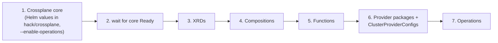

# The Adhar Control Plane — Crossplane v2 In Depth

**Version**: v0.1.0

This guide explains the Adhar control plane from first principles: what it is, why it exists, how it is **built** from Crossplane v2 primitives, how it is **integrated** into the platform, and how it **operates** day to day. No prior Crossplane knowledge is assumed. The terse rule-book companion is [`platform/controlplane/CONVENTIONS.md`](../platform/controlplane/CONVENTIONS.md); the architectural decision is [ADR-0005](adr/0005-crossplane-v2-namespaced.md).

---

## Table of Contents

1. [The Problem It Solves](#1-the-problem-it-solves)
2. [Crossplane in Five Minutes](#2-crossplane-in-five-minutes)
3. [What Crossplane v2 Changed](#3-what-crossplane-v2-changed)
4. [How the Adhar Control Plane Is Built](#4-how-the-adhar-control-plane-is-built)
5. [How It Is Integrated Into the Platform](#5-how-it-is-integrated-into-the-platform)
6. [How It Operates: a Request's Life](#6-how-it-operates-a-requests-life)
7. [Day-2 Automation: Operations](#7-day-2-automation-operations)
8. [Hands-On: Try It Locally](#8-hands-on-try-it-locally)
9. [Debugging the Control Plane](#9-debugging-the-control-plane)
10. [Extending It](#10-extending-it)
11. [Reference: the 23 Platform APIs](#11-reference-the-23-platform-apis)

---

## 1. The Problem It Solves

An IDP must answer requests like *"my team needs a PostgreSQL database"* with self-service — no ticket, no cloud console, no Terraform PR to a central repo. But the answer differs by context: locally it should be a CNPG PostgreSQL pod; on AWS it should be RDS; on GCP, Cloud SQL. And whatever is provisioned must stay continuously managed — drift-corrected, upgradable, deletable — not created once by a script and forgotten.

The Adhar control plane solves this by giving the platform its own **Kubernetes-style APIs for infrastructure**. A developer writes a small YAML resource (`CompositeDatabase`) in their own namespace; the control plane decides what that means for the current environment and keeps reality matching the request forever. The engine underneath is [Crossplane](https://crossplane.io).

## 2. Crossplane in Five Minutes

Crossplane extends the Kubernetes API server into a **universal control plane**. Four concepts carry everything:

| Concept | What it is | Analogy |
|---------|-----------|---------|
| **Managed Resource (MR)** | A Kubernetes object that mirrors one external resource (an RDS instance, a VPC, a Helm release). A **provider** (AWS/Azure/GCP/Helm/Kubernetes…) reconciles it against the real world. | What a `Pod` is to a container, an MR is to a cloud resource |
| **Composite Resource (XR)** | A higher-level object *you* define — e.g. `CompositeDatabase` — that expands into many MRs | A "meal" that expands into ingredients |
| **CompositeResourceDefinition (XRD)** | Defines an XR type: its group/kind and its OpenAPI schema (which parameters users may set) | A CRD, plus platform semantics |
| **Composition** | The recipe: given an XR, which resources to create and how to wire parameters into them | The implementation behind the API |

The power move is the split between XRD and Composition: the **XRD is the contract** (what users ask for), and a **Composition is one implementation** of it. Several Compositions can implement the same XRD — one per cloud — and selection happens per-request via labels. That is exactly how Adhar does multi-cloud.

**Composition functions**: in Crossplane v2, Compositions run a **pipeline of functions** — small programs that receive the XR and return the desired resources. Think of them as the template engine: Adhar mostly uses `function-kcl` (resources computed in the [KCL](https://kcl-lang.io) language), plus go-templating, patch-and-transform, `function-auto-ready` (derives readiness), and `function-python` (for Operations).

## 3. What Crossplane v2 Changed

Adhar is built on **Crossplane v2.3+** and adopts its new model everywhere. If you've seen Crossplane v1 content, un-learn these:

| v1 | v2 (what Adhar uses) |
|----|----------------------|
| XRs are cluster-scoped; users create a separate **Claim** in their namespace | **XRs are namespaced** (`scope: Namespaced`); users create the XR directly in their namespace. Claims are gone |
| XRD `apiVersion: apiextensions.crossplane.io/v1` | XRDs use **`apiextensions.crossplane.io/v2`** (Compositions stay `/v1` — only the XRD moved) |
| Native patch & transform in the Composition | **Pipeline mode only** — everything is functions |
| MRs are cluster-scoped (`rds.aws.upbound.io`) | **Namespaced MR API groups** with a `.m` infix: `rds.aws.m.upbound.io`, `kubernetes.m.crossplane.io`, `helm.m.crossplane.io` |
| `ProviderConfig` per provider | Namespaced MRs reference a shared cluster-scoped **`ClusterProviderConfig`** |
| Connection secrets via `connectionSecretKeys` | Removed — Compositions that surface credentials **create a `Secret` explicitly** |

Why namespacing matters for an IDP: a team's `CompositeDatabase` and the MRs behind it live in the **team's namespace**, so ordinary Kubernetes RBAC and quotas govern who may request what — no custom admission layer needed ([ADR-0005](adr/0005-crossplane-v2-namespaced.md)).

One reserved detail: Crossplane injects a `spec.crossplane` stanza into every XR (composition selection, revision policy). XRD schemas must never declare it — Adhar's XRDs instead expose `spec.compositionSelector` defaults and `spec.parameters` for user input.

## 4. How the Adhar Control Plane Is Built

Everything lives in `platform/controlplane/`:

```text
platform/controlplane/
├── configuration/
│   ├── crossplane.yaml          # Configuration package metadata + provider dependencies
│   ├── xrd/                     # 23 XRDs — the platform's API surface
│   ├── compositions/<domain>/   # 34 Compositions — one file per provider/implementation
│   ├── functions/functions.yaml # the 5 composition functions to install
│   ├── providers/               # provider packages + ClusterProviderConfigs + credential templates
│   └── operations/              # day-2: CronOperations + WatchOperation
├── CONVENTIONS.md               # the rule book (authoritative)
├── embed.go                     # go:embed of configuration/ into the Adhar binary
└── adhar-control-plane-v0.1.0.xpkg  # the same content as a Crossplane package
```

### The API layer (XRDs)

Each file in `xrd/` defines one platform API in group `platform.adhar.io/v1alpha1`. Anatomy, using `database.xrd.yaml`:

```yaml
apiVersion: apiextensions.crossplane.io/v2
kind: CompositeResourceDefinition
metadata:
  name: compositedatabases.platform.adhar.io
spec:
  group: platform.adhar.io
  scope: Namespaced                       # v2 model: lives in the user's namespace
  names: { kind: CompositeDatabase, plural: compositedatabases }
  defaultCompositionRef:
    name: compositedatabase-aws-rds-postgresql   # used when the user doesn't choose
  versions:
    - name: v1alpha1
      served: true
      referenceable: true
      schema:
        openAPIV3Schema:
          # spec.parameters — the user-facing contract:
          #   engine (postgresql|mysql|mariadb|mongodb|redis), engineVersion,
          #   instanceClass, storageSize, multiAZ, backup/encryption toggles, …
          # spec.compositionSelector — defaults to matchLabels: {feature: database}
```

The schema is deliberately rich in **platform vocabulary** (engine, size, backups) and empty of **cloud vocabulary** (no ARNs, no zones-as-required-fields) — cloud specifics get defaults inside the implementations.

### The implementation layer (Compositions)

`compositions/database/` holds one file per implementation: `aws-rds-postgresql.yaml`, `azure-sql.yaml`, `gcp-cloudsql.yaml`. Each is labeled for dispatch:

```yaml
apiVersion: apiextensions.crossplane.io/v1
kind: Composition
metadata:
  name: compositedatabase-aws-rds-postgresql
  labels: { feature: database, provider: aws, engine: postgresql }
spec:
  compositeTypeRef: { apiVersion: platform.adhar.io/v1alpha1, kind: CompositeDatabase }
  mode: Pipeline
  pipeline:
    - step: render-rds
      functionRef: { name: function-kcl }
      input:
        # KCL program: reads oxr.spec.parameters, computes the desired
        # namespaced MRs (rds.aws.m.upbound.io Instance, SubnetGroup, …),
        # wires providerConfigRef {name: "default", kind: ClusterProviderConfig},
        # and creates a native Secret with connection details
    - step: auto-ready
      functionRef: { name: function-auto-ready }   # XR Ready when composed resources are
```

Two composition idioms (per CONVENTIONS §2):

1. **Native Kubernetes objects** — for in-cluster resources, emit them directly (a `Service`, a CNPG `Cluster`); Crossplane v2 manages natives without a wrapper, applying the XR's namespace automatically
2. **Managed resources** — for cloud/remote resources, use the namespaced `.m` API groups and reference the shared `ClusterProviderConfig`s (`default` for each cloud family, `kubernetes-provider`, `helm-provider`)

### The packaging

The `configuration/` tree ships in **two forms of the same content**:

- **Embedded filesystem** (`embed.go`) — compiled into the Adhar binary so the controller can install the control plane with no network or registry dependency (same philosophy as [ADR-0006](adr/0006-embedded-bootstrap-manifests.md))
- **Crossplane Configuration package** (`.xpkg`) — built by `make build-control-plane` via `crossplane xpkg build`; `crossplane.yaml` declares the package metadata and `dependsOn` provider constraints (Upbound AWS/Azure/GCP families ≥ v2, provider-kubernetes, provider-helm, functions). This is the artifact you'd push to an OCI registry for standalone/versioned installs

## 5. How It Is Integrated Into the Platform

The `AdharPlatform` controller (`platform/controllers/adharplatform/crossplane.go`) owns the install, in a **strict order** — each layer only makes sense once the previous one is healthy:



Notes on the order: XRDs must exist before Compositions that reference their kinds; Functions must be installed before any XR reconciles (pipelines would fail); ProviderConfigs come after providers are healthy; Operations last because they're pure day-2. All applies use Server-Side Apply from the embedded filesystem, with per-directory labels in the reconcile status.

**Credentials**: cloud ProviderConfigs read from Secrets (templates under `configuration/providers/`); the production path is workload identity — IRSA on AWS, Workload Identity on GCP, Managed Identity on Azure — so no long-lived keys exist in-cluster ([Production §3](PRODUCTION.md#3-security-hardening-checklist)). DigitalOcean and Civo still use legacy cluster-scoped `ProviderConfig` (their community providers have no namespaced MRs yet).

**GitOps note**: the control plane installs during bootstrap (it's foundation, like ArgoCD itself), but a `crossplane` package also exists in the GitOps stack — environments that prefer to manage Crossplane's lifecycle through ArgoCD can. The XRs users create are ordinary namespaced resources and flow through whatever GitOps process the team uses for its apps.

## 6. How It Operates: a Request's Life

Follow one request end-to-end — a developer wants PostgreSQL:

```yaml
# team-orders namespace
apiVersion: platform.adhar.io/v1alpha1
kind: CompositeDatabase
metadata:
  name: orders-db
  namespace: team-orders
spec:
  crossplane:
    compositionSelector:
      matchLabels: { feature: database, provider: aws, engine: postgresql }
  parameters:
    engine: postgresql
    engineVersion: "16"
    storageSize: 50Gi
    multiAZ: true
```

```mermaid
sequenceDiagram
    participant Dev as Developer (kubectl/GitOps)
    participant API as Kubernetes API
    participant XPC as Crossplane core
    participant Fn as function-kcl pipeline
    participant Prov as provider-aws (RDS family)
    participant AWS as AWS

    Dev->>API: apply CompositeDatabase (namespaced XR)
    API-->>XPC: XR admitted (RBAC + schema validation)
    XPC->>XPC: select Composition by labels<br/>(feature=database, provider=aws, engine=postgresql)
    XPC->>Fn: run pipeline with XR as input
    Fn-->>XPC: desired MRs (rds.aws.m.upbound.io/v1beta1 …) + connection Secret
    XPC->>API: apply MRs in team-orders namespace
    Prov->>AWS: create/converge RDS instance, subnet group, …
    Prov-->>API: MR status (Ready/Synced) updated continuously
    XPC->>API: XR status ← function-auto-ready
    Dev->>API: reads status; mounts connection Secret in app
```

What makes this an *operating model*, not a provisioning script:

- **Continuous reconciliation** — if someone edits the RDS instance in the AWS console, the provider reverts it to the declared state on the next sync; if the XR changes, the diff propagates down
- **Environment dispatch** — the same manifest with `provider: gcp` (or an environment default via `defaultCompositionRef` / selector defaults) lands on Cloud SQL; locally, a Kubernetes-native Composition renders a CNPG cluster instead. The application never changes
- **Deletion discipline** — deleting the XR cascades to its MRs, honoring each MR's `deletionPolicy` (the database XRD exposes `deletionPolicy` and `skipFinalSnapshot` as parameters, so "protect prod data" is a request-level choice)
- **Tenancy for free** — RBAC decides who may create `CompositeDatabase` in which namespace; resource quotas and Kyverno policies apply to XRs like any other resource

## 7. Day-2 Automation: Operations

Some tasks are not "reconcile a desired state" — they're *scheduled or triggered actions*. Crossplane v2's **Operations** (`ops.crossplane.io/v1alpha1`, alpha, enabled via the core `--enable-operations` flag in `hack/crossplane/values*.yaml`) cover these, reusing the same function machinery. Adhar ships three in `configuration/operations/`:

| Operation | Kind | What it does |
|-----------|------|--------------|
| `adhar-daily-backup` | CronOperation (`0 2 * * *`, `concurrencyPolicy: Forbid`) | Emits a Velero `Backup` for `adhar-system` + `crossplane-system` via `function-python`; keeps run history (5 ok / 3 failed) for audit |
| Secret rotation | CronOperation (weekly) | Rotates platform-managed credentials |
| Drift watch | WatchOperation | Watches ConfigMaps and reacts to out-of-band changes |

An Operation pipeline's `function-python` script returns desired resources that Crossplane force-applies (no owner refs) and an output record — so every run is inspectable as an `Operation` object.

## 8. Hands-On: Try It Locally

```bash
# 1. Platform up (control plane installs during bootstrap)
adhar up

# 2. Confirm the control plane is healthy
kubectl get providers,functions                  # all Installed/Healthy
kubectl get xrd | head                           # 23 compositexxx.platform.adhar.io
kubectl get compositions | head                  # 34 implementations

# 3. Request infrastructure (samples for every API in examples/)
kubectl create namespace demo
kubectl apply -n demo -f examples/database.yaml

# 4. Watch it converge
kubectl get compositedatabase -n demo -w         # SYNCED/READY columns
kubectl describe compositedatabase -n demo orders-db   # events tell the story

# 5. See what it composed
crossplane beta trace compositedatabase orders-db -n demo   # full resource tree
```

`examples/` contains a ready-made XR for each major API (`cluster.yaml`, `database.yaml`, `application.yaml`, `environment.yaml`, `team.yaml`, …) — they are the fastest way to learn each schema.

## 9. Debugging the Control Plane

Work down the stack until something is unhealthy:

| Layer | Check |
|-------|-------|
| XR | `kubectl describe <kind> <name> -n <ns>` — composition selection errors and function failures surface as events; `SYNCED=False` means the pipeline or apply failed |
| Composition pipeline | Function pod logs: `kubectl -n crossplane-system logs deploy/function-kcl` (KCL syntax errors land here) |
| Managed resources | `crossplane beta trace …` to find the failing MR, then `kubectl describe` it — provider errors (permissions, quotas, invalid params) appear in MR conditions |
| Provider | `kubectl get providers` healthy? `kubectl -n crossplane-system logs deploy/<provider-...>` |
| ProviderConfig / credentials | MR condition says auth failed → check the `ClusterProviderConfig` and its Secret / workload identity binding |
| Core | `kubectl -n crossplane-system logs deploy/crossplane` — XRD establishment and Operation scheduling issues |

Golden rule: **the event stream on the XR almost always names the guilty layer** — start there, not in provider logs.

## 10. Extending It

Covered step-by-step in [Customization §8](CUSTOMIZATION.md#8-extend-infrastructure-apis-crossplane); in brief:

- **New implementation of an existing API** (e.g. your org's opinionated PostgreSQL): add a Composition with distinct labels (`provider: kubernetes, flavor: acme`); users opt in via `compositionSelector` — the XRD contract doesn't change
- **New platform API** (e.g. `CompositeQueue`): XRD (`/v2`, `Namespaced`) + one Composition per implementation + entry in `crossplane.yaml` if it needs new providers; follow [CONVENTIONS.md](../platform/controlplane/CONVENTIONS.md) exactly (`.m` API groups, `ClusterProviderConfig` names, `function-auto-ready` last)
- Rebuild the package: `make build-control-plane` → new `.xpkg`; the embedded copy ships with the next Adhar release

Review checklist for any control-plane PR: namespaced scope? no `spec.crossplane` in the schema? labels for dispatch? connection secrets created explicitly? deletionPolicy exposed where data loss is possible?

## 11. Reference: the 23 Platform APIs

By domain (each `xrd/<name>.xrd.yaml` ↔ `compositions/<name>/`):

| Domain | API (kind) | Purpose |
|--------|-----------|---------|
| **Workloads** | CompositeApplication (`apps`), CompositeService (`service`), CompositePipeline (`pipeline`), CompositeWebhook (`webhook`) | App delivery building blocks |
| **Infrastructure** | CompositeCluster (`cluster`), CompositeNetwork (`network`), CompositeStorage (`storage`), CompositeDatabase (`database`) | Clusters, networks, storage, databases across clouds |
| **Environments** | CompositeEnvironment (`env`), CompositePlatformConfig (`config`), CompositeGitOps (`gitops`) | Environment and platform wiring |
| **Security** | CompositeAuth (`auth`), CompositeSecrets (`secrets`), CompositeSecretRotation (`secretrotation`), CompositeCompliancePolicy (`compliancepolicy`) | Identity, secrets, compliance |
| **Observability** | CompositeMetrics (`metrics`), CompositeLogs (`logs`), CompositeTraces (`traces`), CompositeHealth (`health`), CompositeCostTracker (`costtracker`) | Telemetry and cost as requestable capabilities |
| **Operations** | CompositeBackup (`backup`), CompositeRestore (`restore`), CompositeScale (`scale`) | Day-2 as API calls |

*(Exact kind names and schemas: `platform/controlplane/configuration/xrd/`; maturity tracked in the [Roadmap](ROADMAP.md).)*

---

**Related**: [Architecture §5](ARCHITECTURE.md#5-infrastructure--control-plane) · [ADR-0005](adr/0005-crossplane-v2-namespaced.md) · [ADR-0007](adr/0007-dual-provisioning-paths.md) · [CONVENTIONS.md](../platform/controlplane/CONVENTIONS.md) · [Customization §8](CUSTOMIZATION.md#8-extend-infrastructure-apis-crossplane)
