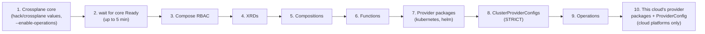

# The Adhar Control Plane — Crossplane v2 In Depth

The control plane is how Adhar answers *"my team needs a database / a cluster / a bucket"* with a Kubernetes API instead of a ticket. This guide assumes **no prior Crossplane knowledge** and covers what it is, how it is built, how it is installed, how a request flows through it, and how to debug and extend it.

Use it to:

- Understand Crossplane v2 and what changed from v1 → [§2](#2-crossplane-in-five-minutes), [§3](#3-what-crossplane-v2-changed)
- Find the platform API you want and its implementations → [§11](#11-reference-the-platform-apis)
- Know exactly what the bootstrap installs, in what order, and why a step is fatal → [§5](#5-how-it-is-integrated-into-the-platform)
- Debug an XR that will not become Ready → [§9](#9-debugging-the-control-plane)
- Add an API or an implementation without breaking the conventions → [§10](#10-extending-it)

The terse rule-book companion is [`platform/controlplane/CONVENTIONS.md`](../platform/controlplane/CONVENTIONS.md); the decision is [ADR-0005](adr/0005-crossplane-v2-namespaced.md); the architectural context is [Architecture §5](ARCHITECTURE.md#5-infrastructure--control-plane).

**Verified**: 2026-09, against the repository and a live DigitalOcean platform.

---

## Table of Contents

1. [The Problem It Solves](#1-the-problem-it-solves)
2. [Crossplane in Five Minutes](#2-crossplane-in-five-minutes)
3. [What Crossplane v2 Changed](#3-what-crossplane-v2-changed)
4. [How the Adhar Control Plane Is Built](#4-how-the-adhar-control-plane-is-built)
5. [How It Is Integrated Into the Platform](#5-how-it-is-integrated-into-the-platform)
6. [How It Operates: a Request's Life](#6-how-it-operates-a-requests-life)
7. [Day-2 Automation: Operations](#7-day-2-automation-operations)
8. [Hands-On: Try It Locally](#8-hands-on-try-it-locally)
9. [Debugging the Control Plane](#9-debugging-the-control-plane)
10. [Extending It](#10-extending-it)
11. [Reference: the Platform APIs](#11-reference-the-platform-apis)
12. [Known Gaps](#12-known-gaps)

---

## 1. The Problem It Solves

An IDP must answer *"my team needs a PostgreSQL database"* with self-service — no ticket, no cloud console, no Terraform PR to a central repo. But the answer differs by context: locally it should be a CNPG PostgreSQL cluster; on AWS, RDS; on GCP, Cloud SQL. And whatever is provisioned must stay continuously managed — drift-corrected, upgradable, deletable — not created once by a script and forgotten.

The Adhar control plane gives the platform its own **Kubernetes-style APIs for infrastructure**. A developer writes a small YAML resource (`CompositeDatabase`) in their own namespace; the control plane decides what that means for the current environment and keeps reality matching the request forever. The engine underneath is [Crossplane](https://crossplane.io).

## 2. Crossplane in Five Minutes

Crossplane extends the Kubernetes API server into a **universal control plane**. Four concepts carry everything:

| Concept | What it is | Analogy |
|---------|-----------|---------|
| **Managed Resource (MR)** | A Kubernetes object mirroring one external resource (an RDS instance, a VPC, a Helm release). A **provider** reconciles it against the real world | What a `Pod` is to a container, an MR is to a cloud resource |
| **Composite Resource (XR)** | A higher-level object *you* define — e.g. `CompositeDatabase` — that expands into many MRs | A "meal" that expands into ingredients |
| **CompositeResourceDefinition (XRD)** | Defines an XR type: group/kind and OpenAPI schema (which parameters users may set) | A CRD, plus platform semantics |
| **Composition** | The recipe: given an XR, which resources to create and how to wire parameters into them | The implementation behind the API |

The power move is the split: the **XRD is the contract** (what users ask for) and a **Composition is one implementation** of it. Several Compositions can implement the same XRD — one per cloud — and selection happens per request via labels. That is exactly how Adhar does multi-cloud.

**Composition functions**: in v2, Compositions run a **pipeline of functions** — small programs that receive the XR and return the desired resources. Adhar mostly uses `function-kcl` (resources computed in the [KCL](https://kcl-lang.io) language), plus go-templating, patch-and-transform, `function-auto-ready` (derives readiness) and `function-python` (Operations).

## 3. What Crossplane v2 Changed

Adhar runs **Crossplane v2.3.1** and adopts its model everywhere. If you have seen v1 content, un-learn these:

| v1 | v2 (what Adhar uses) |
|----|----------------------|
| XRs are cluster-scoped; users create a separate **Claim** in their namespace | **XRs are namespaced** (`scope: Namespaced`); users create the XR directly. Claims are gone |
| XRD `apiextensions.crossplane.io/v1` | XRDs use **`apiextensions.crossplane.io/v2`** (Compositions stay `/v1` — only the XRD moved) |
| Native patch & transform in the Composition | **Pipeline mode only** — everything is functions |
| MRs are cluster-scoped (`rds.aws.upbound.io`) | **Namespaced MR API groups** with a `.m` infix: `rds.aws.m.upbound.io`, `kubernetes.m.crossplane.io`, `helm.m.crossplane.io` |
| `ProviderConfig` per provider | Namespaced MRs reference a shared cluster-scoped **`ClusterProviderConfig`** |
| Connection secrets via `connectionSecretKeys` | Removed — Compositions that surface credentials **create a `Secret` explicitly** |
| `spec.deletionPolicy` on every MR | **Namespaced `.m` MRs have no `deletionPolicy`.** Setting it fails schema validation. Express retention as `managementPolicies: ["Observe","Create","Update","LateInitialize"]` — everything except `Delete` |

Why namespacing matters for an IDP: a team's `CompositeDatabase` and the MRs behind it live in the **team's namespace**, so ordinary Kubernetes RBAC and quotas govern who may request what — no custom admission layer ([ADR-0005](adr/0005-crossplane-v2-namespaced.md)).

One reserved detail: Crossplane injects a `spec.crossplane` stanza into every XR (composition selection, revision policy). XRD schemas must never declare it — Adhar's XRDs expose `spec.compositionSelector` defaults and `spec.parameters` for user input instead.

## 4. How the Adhar Control Plane Is Built

Everything lives in `platform/controlplane/`:

```text
platform/controlplane/
├── configuration/
│   ├── crossplane.yaml          # package metadata + provider dependencies (NOT applied at runtime)
│   ├── rbac/                    # ClusterRole aggregated into Crossplane's SA for composed natives
│   ├── xrd/                     # 25 XRDs — the platform's API surface
│   ├── compositions/<domain>/   # 47 Compositions — one file per implementation
│   ├── functions/functions.yaml # the 5 composition functions
│   ├── providers/               # provider packages, ClusterProviderConfigs, credential templates
│   └── operations/              # day-2: 3 CronOperations + 2 WatchOperations
├── CONVENTIONS.md               # the rule book (authoritative)
├── embed.go                     # go:embed of configuration/ into the Adhar binary
└── dist/adhar-control-plane-<version>.xpkg  # same content as a Crossplane package
                                 # (gitignored; versioned from the git tag, a release asset)
```

### The API layer (XRDs)

Each file in `xrd/` defines one platform API in group `platform.adhar.io`. Anatomy, using `database.xrd.yaml`:

```yaml
apiVersion: apiextensions.crossplane.io/v2
kind: CompositeResourceDefinition
metadata:
  name: compositedatabases.platform.adhar.io
spec:
  group: platform.adhar.io
  scope: Namespaced                       # v2 model: lives in the user's namespace
  names: { kind: CompositeDatabase, plural: compositedatabases }
  defaultCompositionRef:
    name: compositedatabase-aws-rds-postgresql   # used when the user doesn't choose
  versions:
    - name: v1alpha1
      served: true
      referenceable: true
      schema:
        openAPIV3Schema:
          # spec.parameters — the user-facing contract:
          #   engine (postgresql|mysql|mariadb|mongodb|redis), engineVersion,
          #   instanceClass, storageSize, multiAZ, backup/encryption toggles, …
          # spec.compositionSelector — defaults to matchLabels: {feature: database}
```

The schema is deliberately rich in **platform vocabulary** (engine, size, backups) and empty of **cloud vocabulary** (no ARNs, no zones-as-required-fields) — cloud specifics get defaults inside the implementations.

### The implementation layer (Compositions)

`compositions/database/` holds one file per implementation (`aws-rds-postgresql.yaml`, `azure-sql.yaml`, `gcp-cloudsql.yaml`, `local-cnpg.yaml`, `local-redis.yaml`, `local-valkey.yaml`). Each is labeled for dispatch:

```yaml
apiVersion: apiextensions.crossplane.io/v1
kind: Composition
metadata:
  name: compositedatabase-aws-rds-postgresql
  labels: { feature: database, provider: aws, engine: postgresql }
spec:
  compositeTypeRef: { apiVersion: platform.adhar.io/v1alpha1, kind: CompositeDatabase }
  mode: Pipeline
  pipeline:
    - step: render-rds
      functionRef: { name: function-kcl }
      input:
        # KCL program: reads oxr.spec.parameters, computes the desired
        # namespaced MRs (rds.aws.m.upbound.io Instance, SubnetGroup, …),
        # wires providerConfigRef {name: "default", kind: ClusterProviderConfig},
        # and creates a native Secret with connection details
    - step: auto-ready
      functionRef: { name: function-auto-ready }   # XR Ready when composed resources are
```

Two composition idioms (CONVENTIONS §2):

1. **Native Kubernetes objects** — for in-cluster resources, emit them directly (a `Service`, a CNPG `Cluster`); v2 manages natives without a wrapper and applies the XR's namespace automatically
2. **Managed resources** — for cloud/remote resources, use the namespaced `.m` API groups and reference the shared `ClusterProviderConfig`s (`default` per cloud family, `kubernetes-provider`, `helm-provider`)

### The packaging

The `configuration/` tree ships in **two forms of the same content**:

- **Embedded filesystem** (`embed.go`) — compiled into the Adhar binary so the controller installs the control plane with no network or registry dependency (same philosophy as [ADR-0006](adr/0006-embedded-bootstrap-manifests.md)). This is the path every `adhar up` actually takes.
- **Crossplane Configuration package** (`.xpkg`) — built by `make build-control-plane`; `crossplane.yaml` declares metadata and `dependsOn` provider constraints. The artifact for standalone/versioned installs; not applied by the controller.

## 5. How It Is Integrated Into the Platform

The `AdharPlatform` controller (`platform/controllers/adharplatform/crossplane.go`) owns the install. Crossplane is reconciled **after** the GitOps ApplicationSet is applied, deliberately: its convergence is slow and retry-prone, and gating app delivery behind it was the failure that left ArgoCD empty on interrupted runs. Applications never wait on the control plane.


```mermaid
flowchart LR
    core["1. Crossplane core<br/>(hack/crossplane values,<br/>--enable-operations)"] --> wait["2. wait for core Ready<br/>(up to 5 min)"]
    wait --> rbac["3. Compose RBAC"] --> xrds["4. XRDs"] --> comps["5. Compositions"]
    comps --> funcs["6. Functions"] --> pkgs["7. Provider packages<br/>(kubernetes, helm)"]
    pkgs --> pcs["8. ClusterProviderConfigs<br/>(STRICT)"] --> ops["9. Operations"]
    ops --> cloud["10. This cloud's provider<br/>packages + ProviderConfig<br/>(cloud platforms only)"]
```

Why this order: RBAC first because compositions that emit native objects (CNPG `Cluster`s, ArgoCD `Application`s) fail with `cannot patch resource ... forbidden` without it; XRDs must establish before Compositions reference their kinds; Functions before any XR reconciles, or pipelines fail; ProviderConfigs after their provider packages have registered their CRDs; Operations last because they are pure day-2. Everything is Server-Side Apply from the embedded filesystem. Crossplane installs into **`adhar-system`** like every other platform component — the platform never creates `crossplane-system` ([ADR-0011](adr/0011-shared-platform-namespace.md)).

### The ProviderConfig step is strict — and that matters

Steps 3–7 tolerate "CRD not registered yet" and retry, because a provider's CRDs appear a minute or two after its package installs. **Step 8 does not.** `applyManifest` used to treat a `NoMatch` as skip-with-a-warning; the reconcile then set `Status.Crossplane.ControlPlaneApplied = true` and never retried, which produced **fresh clusters with providers installed and zero ProviderConfigs** — a platform that cannot provision anything, and nothing in the status says so. The `requireCRDs` flag now makes that step a hard error, so the reconcile requeues until the ProviderConfigs actually exist. The same strictness applies to the cloud ProviderConfig in step 10.

The whole configuration is gated on `Status.Crossplane.ControlPlaneApplied`, and the reconciler keeps requeueing while it is false — including in watch mode, where there is no `ExitOnSync` loop to fall back on. In local mode `adhar up` refuses to exit until it is true, because no controller would remain to retry.

### Cloud providers: only the active cloud

Upjet provider families register hundreds of CRDs each (AWS + Azure + GCP together ≈ 3,000). Installing all of them pushed a single-control-plane-node API server into timeouts and bought nothing, so step 10 filters `providers/cloud/provider-packages.yaml` to the **platform's own cloud family** (`cloudFamily()`: aws, azure, gcp, digitalocean, civo) and applies only that family's packages and `<family>-providerconfig.yaml`. Additional clouds are opted in by applying their entries manually (`configuration/providers/README.md`). On Kind, no cloud providers are installed at all — their pods would only crash-loop.

**Credentials**: cloud ProviderConfigs read from Secrets in `adhar-system` (templates under `configuration/providers/cloud/`); the production path is workload identity — IRSA on AWS, Workload Identity on GCP, Managed Identity on Azure — so no long-lived keys exist in-cluster ([Production §5](PRODUCTION.md#5-security-hardening)). DigitalOcean and Civo use legacy cluster-scoped `ProviderConfig`: their community providers have no namespaced MRs yet.

**GitOps note**: the control plane installs during bootstrap (it is foundation, like ArgoCD), *and* an `infrastructure/crossplane` package exists in the GitOps stack and is enabled in production — so ArgoCD's self-heal owns the Crossplane Deployment thereafter. To test a controller change against a cloud cluster, park the in-cluster manager (`kubectl scale deploy/adhar-controller-manager --replicas=0`) and run `adhar controller --kubeconfig <path> --platform-name <env> --leader-elect=false` locally.

## 6. How It Operates: a Request's Life

Follow one request end-to-end — a developer wants PostgreSQL:

```yaml
# team-orders namespace
apiVersion: platform.adhar.io/v1alpha1
kind: CompositeDatabase
metadata:
  name: orders-db
  namespace: team-orders
spec:
  crossplane:
    compositionSelector:
      matchLabels: { feature: database, provider: aws, engine: postgresql }
  parameters:
    engine: postgresql
    engineVersion: "16"
    storageSize: 50Gi
    multiAZ: true
```

Note where the selector lives: **`spec.crossplane.compositionSelector`**, not `spec.compositionSelector` — the v2 reserved stanza.

```mermaid
sequenceDiagram
    participant Dev as Developer (kubectl/GitOps)
    participant API as Kubernetes API
    participant XPC as Crossplane core
    participant Fn as function-kcl pipeline
    participant Prov as provider-aws (RDS family)
    participant AWS as AWS

    Dev->>API: apply CompositeDatabase (namespaced XR)
    API-->>XPC: XR admitted (RBAC + schema validation)
    XPC->>XPC: select Composition by labels<br/>(feature=database, provider=aws, engine=postgresql)
    XPC->>Fn: run pipeline with XR as input
    Fn-->>XPC: desired MRs (rds.aws.m.upbound.io …) + connection Secret
    XPC->>API: apply MRs in team-orders namespace
    Prov->>AWS: create/converge RDS instance, subnet group, …
    Prov-->>API: MR status (Ready/Synced) updated continuously
    XPC->>API: XR status ← function-auto-ready
    Dev->>API: reads status; mounts connection Secret in app
```

What makes this an *operating model*, not a provisioning script:

- **Continuous reconciliation** — edit the RDS instance in the AWS console and the provider reverts it on the next sync; change the XR and the diff propagates down
- **Environment dispatch** — the same manifest with `provider: gcp` lands on Cloud SQL; locally a Kubernetes-native Composition renders a CNPG cluster instead. The application never changes
- **Deletion discipline** — deleting the XR cascades to its MRs. Retention is expressed with `managementPolicies` (omit `Delete`), **not** `deletionPolicy`, which namespaced MRs do not have
- **Tenancy for free** — RBAC decides who may create a `CompositeDatabase` in which namespace; quotas and Kyverno policies apply to XRs like any other resource

## 7. Day-2 Automation: Operations

Some tasks are not "reconcile a desired state" — they are *scheduled or triggered actions*. Crossplane v2's **Operations** (`ops.crossplane.io/v1alpha1`, alpha, enabled by the core `--enable-operations` flag in `hack/crossplane/values*.yaml`) cover these, reusing the same function machinery. Adhar ships five objects in four files under `configuration/operations/`:

| Object | Kind | What it does |
|-----------|------|--------------|
| `adhar-daily-backup` | CronOperation `0 2 * * *`, `concurrencyPolicy: Forbid` | Emits a Velero `Backup` via `function-python`; keeps run history (5 ok / 3 failed) for audit |
| `adhar-weekly-secret-rotation` | CronOperation `0 3 * * 0` | Rotates platform-managed credentials |
| `adhar-configmap-drift` | WatchOperation | Watches ConfigMaps and reacts to out-of-band changes |
| `adhar-reconstructability-drill` | CronOperation `0 4 1 * *` | Monthly proof that the platform is reconstructable from Git |
| `adhar-reconstructability-drill-observer` | WatchOperation | Records the drill's outcome |

An Operation pipeline's `function-python` script returns desired resources that Crossplane force-applies (no owner refs) plus an output record — so every run is inspectable as an `Operation` object.

## 8. Hands-On: Try It Locally

```bash
# 1. Platform up (the control plane installs during bootstrap)
adhar up

# 2. Confirm it is healthy
kubectl get providers.pkg.crossplane.io,functions.pkg.crossplane.io   # INSTALLED + HEALTHY
kubectl get xrd                                                       # 25 composite*.platform.adhar.io
kubectl get compositions                                              # 47 implementations
kubectl get clusterproviderconfigs                                    # must NOT be empty (see §5)

# 3. Request infrastructure (samples in examples/)
kubectl create namespace demo
kubectl apply -n demo -f examples/database.yaml

# 4. Watch it converge
kubectl get compositedatabase -n demo -w                # SYNCED / READY columns
kubectl describe compositedatabase -n demo orders-db    # events tell the story

# 5. See what it composed
crossplane beta trace compositedatabase orders-db -n demo   # full resource tree
```

`examples/` contains a ready-made resource for each major API (`cluster.yaml`, `database.yaml`, `application.yaml`, `environment.yaml`, `team.yaml`, `pipeline.yaml`, `registry.yaml`, …) — the fastest way to learn each schema.

## 9. Debugging the Control Plane

Everything runs in **`adhar-system`**. Function and provider Deployments carry a package-revision hash in their names (`function-kcl-01ce52d97135`), so select rather than guess.

| Layer | Check |
|-------|-------|
| XR | `kubectl describe <kind> <name> -n <ns>` — composition-selection errors and function failures surface as events; `SYNCED=False` means the pipeline or the apply failed |
| Composition pipeline | `kubectl -n adhar-system logs deploy/$(kubectl -n adhar-system get deploy -o name \| grep function-kcl \| head -1 \| cut -d/ -f2)` — KCL syntax errors land here |
| Managed resources | `crossplane beta trace …` to find the failing MR, then `kubectl describe` it — provider errors (permissions, quotas, invalid params) appear in MR conditions |
| Provider | `kubectl get providers.pkg.crossplane.io` — `HEALTHY=False` on a cloud family you do not use is expected on a different cloud; then `kubectl -n adhar-system logs deploy/<provider-…>` |
| ProviderConfig / credentials | `kubectl get clusterproviderconfigs` — **empty is a bug, not a state** ([§5](#5-how-it-is-integrated-into-the-platform)); otherwise check the referenced Secret or workload-identity binding |
| Core | `kubectl -n adhar-system logs deploy/crossplane` — XRD establishment and Operation scheduling; `kubectl -n adhar-system logs deploy/crossplane-rbac-manager` for RBAC propagation |
| Install stalled | `kubectl get adharplatform -n adhar-system -o jsonpath='{.items[0].status.crossplane}'` — `controlPlaneApplied: false` means a step is still retrying; the controller logs name it |

Golden rule: **the event stream on the XR almost always names the guilty layer** — start there, not in provider logs.

Two platform-wide traps that bite here specifically:

- **Service links.** Sharing `adhar-system` means cosign's `Service/webhook` injects `WEBHOOK_PORT=tcp://<ip>:443`, which Crossplane parsed as `--webhook-port` and crash-looped on. Crossplane sets `enableServiceLinks: false`; any component reading config from env must too ([CONFLICTS.md](../platform/stack/packages/CONFLICTS.md)).
- **A wave-stuck ArgoCD sync replays the revision it started with.** If the `crossplane` Application sits at `waiting for healthy state of …`, pushing a fix to Gitea changes nothing and `kubectl` edits revert within a minute; patching `operation: null` does not clear it. Terminate through the API — `DELETE /api/v1/applications/<app>/operation` with a `content-type: application/json` header (415 without it) — then hard-refresh.

## 10. Extending It

Covered step by step in [Customization §9](CUSTOMIZATION.md#9-extend-the-infrastructure-apis-crossplane); in brief:

- **New implementation of an existing API** (your org's opinionated PostgreSQL): add a Composition with distinct labels (`provider: kubernetes, flavor: acme`); users opt in via `spec.crossplane.compositionSelector` — the XRD contract does not change
- **New platform API** (e.g. `CompositeQueue`): XRD (`/v2`, `Namespaced`) + one Composition per implementation + an entry in `crossplane.yaml` if it needs new providers; follow [CONVENTIONS.md](../platform/controlplane/CONVENTIONS.md) exactly
- Rebuild the package with `make build-control-plane`; the embedded copy ships with the next Adhar release

Review checklist for any control-plane PR:

- [ ] XRD is `apiextensions.crossplane.io/v2` with `scope: Namespaced`
- [ ] Schema does **not** declare `spec.crossplane`
- [ ] Composition carries dispatch labels and ends with `function-auto-ready`
- [ ] Managed resources use `.m` API groups and a `ClusterProviderConfig` reference
- [ ] **No `deletionPolicy` on any namespaced MR** — retention is `managementPolicies`
- [ ] Connection secrets are created explicitly (no `connectionSecretKeys`, no XR-level `writeConnectionSecretToRef`)
- [ ] Nothing new lands outside `adhar-system` unless it is a tenant namespace

## 11. Reference: the Platform APIs

**25 XRDs** in `configuration/xrd/`, implemented by **47 Compositions** in `configuration/compositions/<domain>/`. The count in parentheses is the number of implementations available today.

| Domain | API (kind) — file | Implementations |
|--------|-----------|---|
| **Workloads** | `CompositeApplication` (apps), `CompositeService` (service), `CompositePipeline` (pipeline), `CompositeWebhook` (webhook), `CompositeProject` (project) | apps (3: ArgoCD app, multi-env, local) · pipeline (3: Argo Workflows, Tekton, local) · service, webhook, project (1 each) |
| **Infrastructure** | `CompositeCluster` (cluster), `CompositeNetwork` (network), `CompositeStorage` (storage), `CompositeDatabase` (database), `CompositeMessaging` (messaging) | cluster (6: EKS, AKS, GKE, DOKS, Civo K3s, Kind) · database (6: RDS, Azure SQL, Cloud SQL, CNPG, Redis, Valkey) · network (3: AWS VPC, Azure VNet, GCP VPC) · storage (2) · messaging (1: Strimzi) |
| **Environments** | `CompositeEnvironment` (env), `CompositePlatformConfig` (config), `CompositeGitOps` (gitops) | env (2) · config, gitops (1 each) |
| **Security** | `CompositeAuthStack` (auth), `CompositeSecret` (secrets), `CompositeSecretRotation` (secretrotation), `CompositeCompliancePolicy` (compliancepolicy) | auth (1: Keycloak) · secrets (2: ESO, local) · secretrotation (2: AWS Secrets Manager, local) · compliance (3: Kyverno, OPA Gatekeeper, local) |
| **Observability** | `CompositeMetrics` (metrics), `CompositeLogging` (logs), `CompositeTrace` (traces), `CompositeHealth` (health), `CompositeCostTracker` (costtracker) | Prometheus ServiceMonitor · Loki stack · Jaeger · healthcheck · OpenCost (1 each) |
| **Operations** | `CompositeBackupPolicy` (backup), `CompositeRestore` (restore), `CompositeScale` (scale) | Velero backup · Velero restore · HPA (1 each) |

*(Exact kinds and schemas: `platform/controlplane/configuration/xrd/`; maturity tracked in the [Roadmap](ROADMAP.md).)*

## 12. Known Gaps

Honest list, verified in this tree. None of these block the paths exercised so far; all are worth fixing before the corresponding API is relied on.

| Gap | Where | Impact |
|---|---|---|
| `deletionPolicy` emitted on namespaced MRs | `compositions/database/{aws-rds-postgresql,azure-sql,gcp-cloudsql}.yaml`, `compositions/network/{aws-vpc,azure-vnet,gcp-vpc}.yaml`, and the ApplicationSet branch of `compositions/gitops/argocd-project.yaml` | The field does not exist on `.m` resources, so the apply fails schema validation. The four cluster compositions were already converted to `managementPolicies`; these were not |
| `crossplane-system` referenced in backup scope | `configuration/operations/backup-cronoperation.yaml`, `configuration/operations/README.md`, `configuration/providers/README.md` §"Namespace Isolation", `providers/cloud/credential-secrets-template.yaml` | Stale: the platform never creates that namespace. The backup simply covers a namespace that does not exist |
| Cloud providers can outlive their platform's cloud | Live DigitalOcean cluster carries `provider-aws-eks` / `provider-family-aws` in `INSTALLED=True, HEALTHY=False` | Pre-dates the per-cloud filter in [§5](#5-how-it-is-integrated-into-the-platform); harmless but noisy. Delete the `Provider` objects to clear |
| XR-level `writeConnectionSecretToRef` | `compositions/gitops/argocd-project.yaml` | v1-only per CONVENTIONS §1; coordinates belong on `status` |

---

**Related**: [Architecture §5](ARCHITECTURE.md#5-infrastructure--control-plane) · [ADR-0005](adr/0005-crossplane-v2-namespaced.md) · [ADR-0007](adr/0007-dual-provisioning-paths.md) · [CONVENTIONS.md](../platform/controlplane/CONVENTIONS.md) · [Customization §9](CUSTOMIZATION.md#9-extend-the-infrastructure-apis-crossplane)
