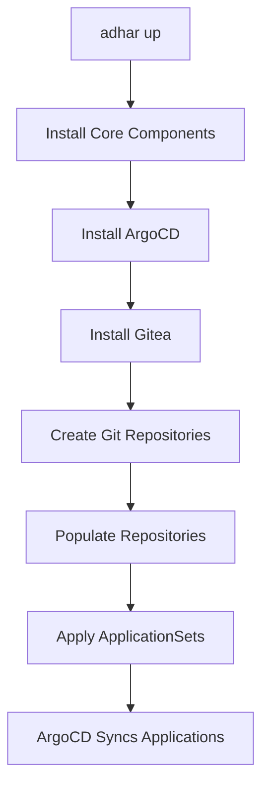

# Adhar GitOps Implementation with `adhar://` Shorthand Syntax

This document describes the complete GitOps implementation for the Adhar platform, including the `adhar://` shorthand syntax for referencing platform components.

## 🚀 Overview

The Adhar platform now supports full GitOps workflows using:
- **Internal Gitea repositories** for storing platform manifests
- **`adhar://` shorthand syntax** for referencing platform components
- **ArgoCD ApplicationSets** for automated deployment
- **Automatic reference resolution** for simplified manifest management

## 📁 Architecture

```
platform/stack/
├── packages/                    # Platform packages (copied to Gitea)
│   ├── security/
│   ├── data/
│   ├── observability/
│   ├── application/
│   ├── infrastructure/
│   └── core/
├── environments/                # Environment configurations (copied to Gitea)
│   ├── local/
│   ├── development/
│   ├── staging/
│   └── production/
├── adhar-appset-gitops.yaml    # GitOps ApplicationSet with adhar:// syntax
├── adhar-appset-local.yaml     # Original ApplicationSet (backward compatibility)
├── gitops_resolver.go          # GitOps resolver implementation
├── manager.go                  # Updated platform manager
└── examples/                   # Example manifests
```

## 🔧 `adhar://` Shorthand Syntax

The `adhar://` syntax provides a simple way to reference platform components:

### Supported Reference Types

| Reference Type | Example | Resolved Path |
|----------------|---------|---------------|
| **Packages** | `adhar://packages/security/cert-manager` | `{repo}/packages/security/cert-manager` |
| **Core** | `adhar://core/adhar-console` | `{repo}/packages/core/adhar-console` |
| **Application** | `adhar://application/argo-workflows` | `{repo}/packages/application/argo-workflows` |
| **Infrastructure** | `adhar://infrastructure/crossplane` | `{repo}/packages/infrastructure/crossplane` |
| **Data** | `adhar://data/postgresql` | `{repo}/packages/data/postgresql` |
| **Security** | `adhar://security/vault` | `{repo}/packages/security/vault` |
| **Observability** | `adhar://observability/prometheus` | `{repo}/packages/observability/prometheus` |
| **Environments** | `adhar://environments/local` | `{env-repo}/environments/local` |

### Manifest Types

You can specify manifest types for different deployment scenarios:

- `install` - Standard installation manifests
- `dev` - Development environment manifests
- `prod` - Production environment manifests
- `staging` - Staging environment manifests
- `testing` - Testing environment manifests
- `base` - Base Kustomize manifests
- `values` - Helm values files

## 📝 Usage Examples

### 1. Basic Application with `adhar://` References

```yaml
apiVersion: argoproj.io/v1alpha1
kind: Application
metadata:
  name: cert-manager
  namespace: adhar-system
  annotations:
    adhar.io/adhar-path: "adhar://packages/security/cert-manager"
    adhar.io/manifest-type: "install"
spec:
  destination:
    namespace: "cert-manager"
    server: https://kubernetes.default.svc
  project: default
  sources:
    - path: "adhar://packages/security/cert-manager/manifests"
      repoURL: http://gitea-argocd.adhar-system.svc.cluster.local:3000/gitea_admin/packages
      targetRevision: main
  syncPolicy:
    automated:
      prune: true
      selfHeal: true
```

### 2. ApplicationSet with `adhar://` References

```yaml
apiVersion: argoproj.io/v1alpha1
kind: ApplicationSet
metadata:
  name: adhar-gitops-platform
  namespace: adhar-system
spec:
  generators:
    - list:
        elements:
          - name: "cert-manager"
            namespace: "cert-manager"
            adharPath: "adhar://packages/security/cert-manager"
            manifestType: "install"
          - name: "vault"
            namespace: "vault"
            adharPath: "adhar://packages/security/vault"
            manifestType: "install"
  goTemplate: true
  template:
    metadata:
      name: "{{ .name }}"
      annotations:
        adhar.io/adhar-path: "{{ .adharPath }}"
        adhar.io/manifest-type: "{{ .manifestType }}"
    spec:
      destination:
        namespace: "{{ .namespace }}"
        server: https://kubernetes.default.svc
      project: default
      sources:
        - path: "{{ .adharPath }}/manifests"
          repoURL: http://gitea-argocd.adhar-system.svc.cluster.local:3000/gitea_admin/packages
          targetRevision: main
```

## 🛠️ CLI Commands

### Resolve `adhar://` References

```bash
# Resolve references in a single file
adhar gitops resolve input.yaml output.yaml

# Generate all GitOps manifests
adhar gitops resolve

# Validate all adhar:// references
adhar gitops resolve --validate-only

# Use custom repository URLs
adhar gitops resolve --packages-repo "http://custom-gitea:3000/packages" input.yaml output.yaml
```

### Platform Management

```bash
# Start platform with GitOps
adhar up

# Check GitOps status
adhar gitops status

# Sync GitOps applications
adhar gitops sync
```

## 🔄 GitOps Workflow

### 1. Platform Initialization



### 2. Repository Population

The platform automatically:
1. **Creates** `packages` and `environments` repositories in Gitea
2. **Copies** platform stack content to repositories
3. **Commits** and **pushes** content to Git
4. **Configures** ArgoCD to use internal repositories

### 3. Application Deployment

ArgoCD automatically:
1. **Monitors** Git repositories for changes
2. **Resolves** `adhar://` references to full paths
3. **Deploys** applications to Kubernetes
4. **Maintains** desired state through GitOps

## 🔍 Reference Resolution

### Automatic Resolution

The `AdharResolver` automatically converts:

```yaml
# Input
path: "adhar://packages/security/cert-manager/manifests"

# Output
path: "packages/security/cert-manager/manifests"
repoURL: "http://gitea-argocd.adhar-system.svc.cluster.local:3000/gitea_admin/packages"
```

### Component Mapping

Common components are automatically mapped:

| Component | `adhar://` Reference | Full Path |
|-----------|---------------------|-----------|
| cert-manager | `adhar://packages/security/cert-manager` | `packages/security/cert-manager` |
| vault | `adhar://packages/security/vault` | `packages/security/vault` |
| prometheus | `adhar://packages/observability/kube-prometheus` | `packages/observability/kube-prometheus` |
| argo-workflows | `adhar://packages/application/argo-workflows` | `packages/application/argo-workflows` |

## 🚨 Troubleshooting

### Common Issues

1. **Repository Not Found**
   ```
   Error: failed to clone packages repository
   Solution: Ensure Gitea is running and repositories are created
   ```

2. **Invalid `adhar://` Reference**
   ```
   Error: invalid adhar reference: adhar://invalid/path
   Solution: Use valid reference format: adhar://packages/category/component
   ```

3. **ArgoCD Sync Failed**
   ```
   Error: ArgoCD application sync failed
   Solution: Check repository URLs and authentication
   ```

### Debug Commands

```bash
# Check repository status
kubectl get gitrepositories -n adhar-system

# Check ArgoCD applications
kubectl get applications -n adhar-system

# Check Gitea repositories
kubectl exec -n adhar-system deployment/gitea -- ls /data/git/gitea-repositories/gitea_admin/

# Validate adhar:// references
adhar gitops resolve --validate-only
```

## 🔧 Configuration

### Repository URLs

Default configuration:
- **Packages Repository**: `http://gitea-argocd.adhar-system.svc.cluster.local:3000/gitea_admin/packages`
- **Environments Repository**: `http://gitea-argocd.adhar-system.svc.cluster.local:3000/gitea_admin/environments`

### Custom Configuration

You can override repository URLs:

```bash
adhar gitops resolve \
  --packages-repo "http://custom-gitea:3000/packages" \
  --environments-repo "http://custom-gitea:3000/environments" \
  input.yaml output.yaml
```

## 📚 Best Practices

1. **Use `adhar://` references** for all platform components
2. **Validate references** before committing changes
3. **Use appropriate manifest types** (dev, prod, staging)
4. **Keep repositories synchronized** with local changes
5. **Monitor ArgoCD sync status** regularly

## 🎯 Benefits

- **Simplified References**: Easy-to-use `adhar://` syntax
- **Automatic Resolution**: No manual path management
- **GitOps Compliance**: Full Git-based workflow
- **Environment Consistency**: Same syntax across environments
- **Easy Maintenance**: Centralized component management

## 🔮 Future Enhancements

- **Template Variables**: Support for `{{ .variable }}` in `adhar://` paths
- **Version Pinning**: Support for `adhar://packages/security/cert-manager@v1.0.0`
- **Conditional Deployment**: Environment-specific component selection
- **Dependency Resolution**: Automatic dependency management
- **Validation Rules**: Custom validation for `adhar://` references
