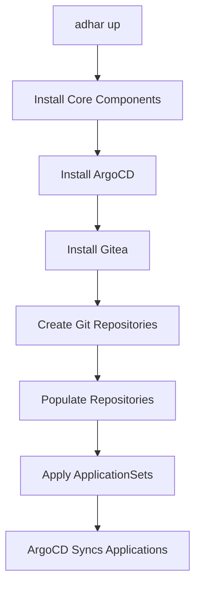

# Platform Stack - ArgoCD Integration

This directory contains the configuration files for integrating ArgoCD with the Adhar platform, ensuring resilient and stable GitOps operations.

## 🏗️ Architecture Overview

### Resilient Design Principles

1. **Service Name Resolution**: Use service names instead of IP addresses
2. **Dedicated Services**: Separate services for different access patterns
3. **Configuration Management**: Centralized configuration via ConfigMaps
4. **Automatic Recovery**: Self-healing mechanisms for service changes

### Components

#### 1. Gitea Services
- **`gitea-http`**: Headless service for direct pod access
- **`gitea-http-clusterip`**: ClusterIP service (may change IP on restarts)
- **`gitea-argocd`**: Dedicated service for ArgoCD access (most stable)

#### 2. ArgoCD Configuration
- **`gitea-argocd-config`**: ConfigMap for service discovery
- **`repo-environments`**: Secret for environments repository access
- **`repo-packages`**: Secret for packages repository access

#### 3. Repository Secrets
- **Authentication**: Gitea admin credentials
- **URLs**: Service-based URLs (not IP-based)
- **Security**: Insecure flag for internal cluster communication

## 🔧 Configuration Files

### `argocd-auth.yaml`
Main configuration file containing:
- Dedicated Gitea service for ArgoCD
- Repository authentication secrets
- Service discovery ConfigMap

### `update-argocd-endpoints.sh`
Utility script for updating endpoints when services change:
```bash
./platform/stack/update-argocd-endpoints.sh
```

## 🚀 Usage

### Initial Setup
```bash
# Apply the complete configuration
kubectl apply -f platform/stack/argocd-auth.yaml

# Restart ArgoCD to pick up changes
kubectl rollout restart deployment argo-cd-argocd-repo-server -n adhar-system
```

### Updating Endpoints
```bash
# Run the update script when services change
./platform/stack/update-argocd-endpoints.sh
```

### Verification
```bash
# Check service status
kubectl get svc -n adhar-system | grep gitea

# Check repository secrets
kubectl get secrets -n adhar-system | grep repo

# Check ArgoCD logs
kubectl logs -n adhar-system deployment/argo-cd-argocd-repo-server
```

## 🔍 Troubleshooting

### Common Issues

1. **Connection Refused**
   - Service IP may have changed
   - Run `update-argocd-endpoints.sh`
   - Restart ArgoCD repo-server

2. **Repository Not Found**
   - Verify Gitea repositories exist
   - Check repository permissions
   - Verify admin credentials

3. **Service Unavailable**
   - Check Gitea pod status
   - Verify service selectors
   - Check network policies

### Debugging Commands

```bash
# Test service connectivity
kubectl run test-connectivity --image=curlimages/curl --rm -it --restart=Never -- \
  curl -v "http://gitea-argocd.adhar-system.svc.cluster.local:3000/gitea_admin/packages"

# Check service endpoints
kubectl get endpoints gitea-argocd -n adhar-system

# Verify DNS resolution
kubectl run test-dns --image=busybox --rm -it --restart=Never -- \
  nslookup gitea-argocd.adhar-system.svc.cluster.local
```

## 📋 Service URLs

### Current Configuration
- **Environments**: `http://gitea-argocd.adhar-system.svc.cluster.local:3000/gitea_admin/environments`
- **Packages**: `http://gitea-argocd.adhar-system.svc.cluster.local:3000/gitea_admin/packages`

### Fallback URLs
- **Primary**: `gitea-argocd.adhar-system.svc.cluster.local`
- **Secondary**: `gitea-http.adhar-system.svc.cluster.local`
- **Legacy**: `gitea-http-clusterip.adhar-system.svc.cluster.local`

## 🔒 Security

### Authentication
- **Username**: `gitea_admin`
- **Password**: Stored in Kubernetes secrets
- **Access**: Internal cluster only

### Network Security
- **Internal Access**: Services only accessible within cluster
- **No External Exposure**: All communication internal
- **Service Mesh**: Compatible with Istio/Linkerd if needed

## 📈 Monitoring

### Health Checks
- **Service Status**: Monitor service endpoints
- **Pod Health**: Check Gitea and ArgoCD pod status
- **Connection Logs**: Monitor ArgoCD repository access logs

### Metrics
- **Service Response Time**: Monitor Gitea service performance
- **Repository Access**: Track successful/failed repository connections
- **Sync Status**: Monitor ArgoCD application sync status

## 🔄 Maintenance

### Regular Tasks
1. **Service Monitoring**: Check service health weekly
2. **Log Review**: Review ArgoCD logs for issues
3. **Configuration Updates**: Update endpoints when services change
4. **Security Updates**: Rotate credentials periodically

### Emergency Procedures
1. **Service Failure**: Restart affected services
2. **Connectivity Issues**: Run endpoint update script
3. **Authentication Problems**: Verify secret configuration
4. **Repository Issues**: Check Gitea repository status

## 📚 References

- [ArgoCD Documentation](https://argo-cd.readthedocs.io/)
- [Kubernetes Services](https://kubernetes.io/docs/concepts/services-networking/service/)
- [Gitea Documentation](https://docs.gitea.io/)
- [Adhar Platform Documentation](../README.md)

---

# GitOps Implementation with `adhar://` Shorthand Syntax

## 🚀 GitOps Overview

The Adhar platform supports full GitOps workflows using:
- **Internal Gitea repositories** for storing platform manifests
- **`adhar://` shorthand syntax** for referencing platform components
- **ArgoCD ApplicationSets** for automated deployment
- **Automatic reference resolution** for simplified manifest management

## 📁 GitOps Architecture

```
platform/stack/
├── packages/                    # Platform packages (copied to Gitea)
│   ├── security/
│   ├── data/
│   ├── observability/
│   ├── application/
│   ├── infrastructure/
│   └── core/
├── environments/                # Environment configurations (copied to Gitea)
│   ├── local/
│   ├── development/
│   ├── staging/
│   └── production/
├── adhar-appset-gitops.yaml    # GitOps ApplicationSet with adhar:// syntax
├── adhar-appset-local.yaml     # Original ApplicationSet (backward compatibility)
├── gitops_resolver.go          # GitOps resolver implementation
└── manager.go                  # Updated platform manager
```

## 🔧 `adhar://` Shorthand Syntax

The `adhar://` syntax provides a simple way to reference platform components:

### Supported Reference Types

| Reference Type | Example | Resolved Path |
|----------------|---------|---------------|
| **Packages** | `adhar://packages/security/cert-manager` | `{repo}/packages/security/cert-manager` |
| **Core** | `adhar://core/adhar-console` | `{repo}/packages/core/adhar-console` |
| **Application** | `adhar://application/argo-workflows` | `{repo}/packages/application/argo-workflows` |
| **Infrastructure** | `adhar://infrastructure/crossplane` | `{repo}/packages/infrastructure/crossplane` |
| **Data** | `adhar://data/postgresql` | `{repo}/packages/data/postgresql` |
| **Security** | `adhar://security/vault` | `{repo}/packages/security/vault` |
| **Observability** | `adhar://observability/prometheus` | `{repo}/packages/observability/prometheus` |
| **Environments** | `adhar://environments/local` | `{env-repo}/environments/local` |

### Manifest Types

You can specify manifest types for different deployment scenarios:

- `install` - Standard installation manifests
- `dev` - Development environment manifests
- `prod` - Production environment manifests
- `staging` - Staging environment manifests
- `testing` - Testing environment manifests
- `base` - Base Kustomize manifests
- `values` - Helm values files

## 📝 GitOps Usage Examples

### 1. Basic Application with `adhar://` References

```yaml
apiVersion: argoproj.io/v1alpha1
kind: Application
metadata:
  name: cert-manager
  namespace: adhar-system
  annotations:
    adhar.io/adhar-path: "adhar://packages/security/cert-manager"
    adhar.io/manifest-type: "install"
spec:
  destination:
    namespace: "cert-manager"
    server: https://kubernetes.default.svc
  project: default
  sources:
    - path: "adhar://packages/security/cert-manager/manifests"
      repoURL: http://gitea-argocd.adhar-system.svc.cluster.local:3000/gitea_admin/packages
      targetRevision: main
  syncPolicy:
    automated:
      prune: true
      selfHeal: true
```

### 2. ApplicationSet with `adhar://` References

```yaml
apiVersion: argoproj.io/v1alpha1
kind: ApplicationSet
metadata:
  name: adhar-gitops-platform
  namespace: adhar-system
spec:
  generators:
    - list:
        elements:
          - name: "cert-manager"
            namespace: "cert-manager"
            adharPath: "adhar://packages/security/cert-manager"
            manifestType: "install"
          - name: "vault"
            namespace: "vault"
            adharPath: "adhar://packages/security/vault"
            manifestType: "install"
  goTemplate: true
  template:
    metadata:
      name: "{{ .name }}"
      annotations:
        adhar.io/adhar-path: "{{ .adharPath }}"
        adhar.io/manifest-type: "{{ .manifestType }}"
    spec:
      destination:
        namespace: "{{ .namespace }}"
        server: https://kubernetes.default.svc
      project: default
      sources:
        - path: "{{ .adharPath }}/manifests"
          repoURL: http://gitea-argocd.adhar-system.svc.cluster.local:3000/gitea_admin/packages
          targetRevision: main
```

## 🛠️ GitOps CLI Commands

### Resolve `adhar://` References

```bash
# Resolve references in a single file
adhar gitops resolve input.yaml output.yaml

# Generate all GitOps manifests
adhar gitops resolve

# Validate all adhar:// references
adhar gitops resolve --validate-only

# Use custom repository URLs
adhar gitops resolve --packages-repo "http://custom-gitea:3000/packages" input.yaml output.yaml
```

### Platform Management

```bash
# Start platform with GitOps
adhar up

# Check GitOps status
adhar gitops status

# Sync GitOps applications
adhar gitops sync
```

## 🔄 GitOps Workflow

### 1. Platform Initialization



### 2. Repository Population

The platform automatically:
1. **Creates** `packages` and `environments` repositories in Gitea
2. **Copies** platform stack content to repositories
3. **Commits** and **pushes** content to Git
4. **Configures** ArgoCD to use internal repositories

### 3. Application Deployment

ArgoCD automatically:
1. **Monitors** Git repositories for changes
2. **Resolves** `adhar://` references to full paths
3. **Deploys** applications to Kubernetes
4. **Maintains** desired state through GitOps

## 🔍 Reference Resolution

### Automatic Resolution

The `AdharResolver` automatically converts:

```yaml
# Input
path: "adhar://packages/security/cert-manager/manifests"

# Output
path: "packages/security/cert-manager/manifests"
repoURL: "http://gitea-argocd.adhar-system.svc.cluster.local:3000/gitea_admin/packages"
```

### Component Mapping

Common components are automatically mapped:

| Component | `adhar://` Reference | Full Path |
|-----------|---------------------|-----------|
| cert-manager | `adhar://packages/security/cert-manager` | `packages/security/cert-manager` |
| vault | `adhar://packages/security/vault` | `packages/security/vault` |
| prometheus | `adhar://packages/observability/kube-prometheus` | `packages/observability/kube-prometheus` |
| argo-workflows | `adhar://packages/application/argo-workflows` | `packages/application/argo-workflows` |

## 🚨 GitOps Troubleshooting

### Common Issues

1. **Repository Not Found**
   ```
   Error: failed to clone packages repository
   Solution: Ensure Gitea is running and repositories are created
   ```

2. **Invalid `adhar://` Reference**
   ```
   Error: invalid adhar reference: adhar://invalid/path
   Solution: Use valid reference format: adhar://packages/category/component
   ```

3. **ArgoCD Sync Failed**
   ```
   Error: ArgoCD application sync failed
   Solution: Check repository URLs and authentication
   ```

### Debug Commands

```bash
# Check repository status
kubectl get gitrepositories -n adhar-system

# Check ArgoCD applications
kubectl get applications -n adhar-system

# Check Gitea repositories
kubectl exec -n adhar-system deployment/gitea -- ls /data/git/gitea-repositories/gitea_admin/

# Validate adhar:// references
adhar gitops resolve --validate-only
```

## 🔧 GitOps Configuration

### Repository URLs

Default configuration:
- **Packages Repository**: `http://gitea-argocd.adhar-system.svc.cluster.local:3000/gitea_admin/packages`
- **Environments Repository**: `http://gitea-argocd.adhar-system.svc.cluster.local:3000/gitea_admin/environments`

### Custom Configuration

You can override repository URLs:

```bash
adhar gitops resolve \
  --packages-repo "http://custom-gitea:3000/packages" \
  --environments-repo "http://custom-gitea:3000/environments" \
  input.yaml output.yaml
```

## 📚 GitOps Best Practices

1. **Use `adhar://` references** for all platform components
2. **Validate references** before committing changes
3. **Use appropriate manifest types** (dev, prod, staging)
4. **Keep repositories synchronized** with local changes
5. **Monitor ArgoCD sync status** regularly

## 🎯 GitOps Benefits

- **Simplified References**: Easy-to-use `adhar://` syntax
- **Automatic Resolution**: No manual path management
- **GitOps Compliance**: Full Git-based workflow
- **Environment Consistency**: Same syntax across environments
- **Easy Maintenance**: Centralized component management

## 🔮 Future Enhancements

- **Template Variables**: Support for `{{ .variable }}` in `adhar://` paths
- **Version Pinning**: Support for `adhar://packages/security/cert-manager@v1.0.0`
- **Conditional Deployment**: Environment-specific component selection
- **Dependency Resolution**: Automatic dependency management
- **Validation Rules**: Custom validation for `adhar://` references
